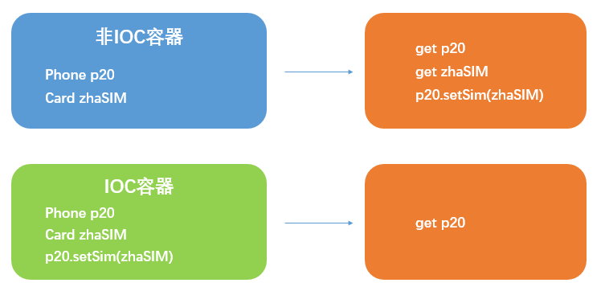
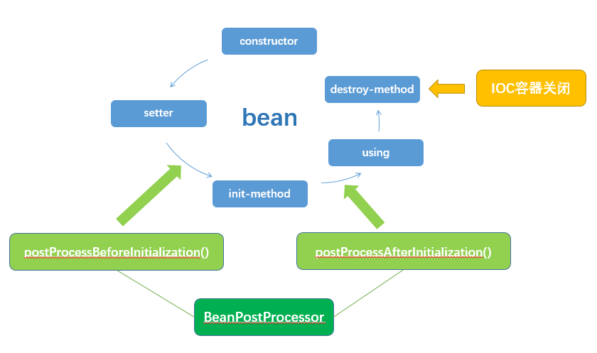

# Spring Basic
## What is Spring?
1. 开源
2. 简化企业级应用
3. IOC和AOP的容器框架

## Description of Spring
1. 轻量级，非入侵
2. 依赖注入(DI: Dependency Injection)
3. 面向切面编程(AOP: Aspect Oriented Programming)
4. 容器，管理对象的生命周期
5. 框架
6. 一站式

## Related Jar Packages
- commons-logging
- spring-beans
- spring-context
- spring-core
- spring-expression

##### Example: Hello World
##### 1 实体类
```java
package com.hello;

@Getter
@Setter
public class HelloSpring {
    private String name;

    public void sayHello(){
        System.out.println("Hello " + this.name);
    }
}
```

##### 2 Spring的配置文件
在项目的类路径(classpath)下创建Spring的 `xml` 配置文件，名称任意，习惯名为 `applicationContext.xml`
```xml
// src/applicationContext.xml
<?xml version="1.0" encoding="UTF-8"?>
<beans xmlns="http://www.springframework.org/schema/beans"
       xmlns:xsi="http://www.w3.org/2001/XMLSchema-instance"
       xsi:schemaLocation="http://www.springframework.org/schema/beans http://www.springframework.org/schema/beans/spring-beans.xsd">
    <bean id="spring" class="com.hello.HelloSpring">
        <property name="name" value="Spring"/>
    </bean>
</beans>
```

##### 3 启用IOC容器
指定Spring的配置文件，创建一个 `ApplicationContext` 的容器引用对象，使用对象的 `getBean` 方法直接获取bean对象
```java
package com.hello;

import org.springframework.context.ApplicationContext;
import org.springframework.context.support.ClassPathXmlApplicationContext;

public class HelloMain {
    public static void main(String[] args) {
        ApplicationContext context = new ClassPathXmlApplicationContext("applicationContext.xml");
        HelloSpring spring = (HelloSpring) context.getBean("spring");
        spring.sayHello();
    }
}
```

## IOC & DI
### IOC(Inversion of Control)
1. 控制反转
2. 容器主动将资源推送给有需要的组件
3. 组件只需选择接受资源的方式

### DI(Dependency Injection)
1. 依赖注入，IOC的另一种表述方式
2. 组件以特定的方式接受容器推送的资源

##### Example
```java
class Card{
    ...
}

class Phone{
    Card sim;
    public void setSim(Card sim){
        this.sim = sim;
    }
}
```



## config bean by XML
- <beans\>
- <bean\>
- <property\>
- <constructor-arg\>
- <value\>
- <ref\>
- <null\>
- <list\>
- <set\>
- <map\>
- <entry\>
- <props\>
- <prop\>

## IOC container
1. BeanFactory: Spring 底层的IOC容器，主要面向框架内部
2. ApplicationContext: 面向使用Spring的开发人员的IOC容器

### ApplicationContext
- interface ApplicationContext
- interface ConfigurableApplicationContext
- class ClassPathXmlApplicationContext
- class FileSystemXmlApplicationContext
- WebApplicationContext

默认情况下，`ApplicationContext` 容器在初始化的时候，会自动实例化容器中的bean对象，并通过 `setter` 或 `constructor` 的方式为bean注入属性。

### ClassPathXmlApplicationContext
指定xml配置文件：
1. xml在src目录下，则直接写 `文件名.扩展名`
2. xml在src目录的其他包下，则指定文件目录要以 `/`(斜杠) 或 `\\`(双反斜杠) 开头，如 `/com/beans/autowire/bean-autowire-config.xml`

### get bean
通过 `BeanFactory` 接口的 `getBean` 方法，获取bean，`ApplicationContext` 就继承了 `BeanFactory` 接口。

### Dependency Injection
1. setter: 属性注入
2. constructor: 构造器注入
3. 工厂方法注入(很少用)

#### setter injection
在 `xml` 配置文件中使用 `<property>` 标签注入属性，指定的属性必须有相应的 `setter` 方法。

#### constructor injection
在 `xml` 配置文件中使用 `<constructor-arg>` 标签通过相应的构造方法注入属性。
##### Example
1. 实体类 Car
```java
package com.beans.injection;
public class Car {
    private String brand;
    private double price;
    private int maxSpeed;
    public Car(String brand, double price) {
        this.brand = brand;
        this.price = price;
    }
    public Car(String brand, int maxSpeed) {
        this.brand = brand;
        this.maxSpeed = maxSpeed;
    }
}
```

2. src/applicationContext.xml
```xml
<bean id="bmw" class="com.beans.injection.Car">
    <constructor-arg value="BMW" index="0"/>
    <constructor-arg value="200000" index="1" type="double"/>
</bean>
<bean id="bench" class="com.beans.injection.Car">
    <constructor-arg value="Bench" index="0"/>
    <constructor-arg value="200" index="1" type="int"/>
</bean>
```

#### bean reference
1. 通过 `ref` 属性或 `<ref>` 标签对bean进行引用
2. 创建内部bean

##### bean reference by ref
在 `<property>` 和 `<constructor-arg>` 标签中，可以通过 `ref` 属性(或 `<ref>` 标签)引用其他的bean，只需指明bean的id即可。
##### Example
1. 实体类 Person
```java
package com.beans.injection;
@Getter
@Setter
public class Person {
    private String name;
    private int age;
    private Car car;
}
package com.beans.injection;
public class Car {
    ...
}
```

2. src/applicationContext.xml
```xml
<bean id="bmw" class="com.beans.injection.Car">...</bean>
<bean id="Jam" class="com.beans.injection.Person">
    <property name="name" value="Jam"/>
    <property name="age" value="30"/>
    <!--<property name="car" ref="bmw"/>-->
    <property name="car">
        <ref bean="bmw"/>
    </property>
</bean>
```

##### bean reference by inner bean
在 `<property>` 和 `<constructor-arg>` 标签中，通过创建 `<bean>` 作为属性的值。

这种方式创建的bean是内部bean，所以其他的bean无法访问，因此内部bean不需要id属性。

##### Example
```xml
<bean id="Sam" class="com.beans.injection.Person">
    <constructor-arg value="Sam"/>
    <constructor-arg value="40"/>
    <constructor-arg>
        <bean class="com.beans.injection.Car">
            <constructor-arg value="Bench"/>
            <constructor-arg value="200" type="int"/>
        </bean>
    </constructor-arg>
</bean>
```

##### cascade property
如果属性是对象，还可以通过 `<property>` 标签为属性的属性赋值，使用 `name` 指定引用的对象和属性(`name="property.property"`)，此时该属性的引用不能为null。

##### Example
```xml
<bean id="Jam" class="com.beans.injection.Person">
    <property name="name" value="Jam"/>
    <property name="age" value="30"/>
    <property name="car">
        <ref bean="bmw"/>
    </property>
    <property name="car.maxSpeed" value="300"/>
</bean>
```

#### create collection bean
定义在 `<constructor-arg>` 或 `<property>` 中作为参数的集合bean：
- 使用 `<list>` 标签创建 `java.util.List` 或 数组类型的bean对象
- 使用 `<set>` 标签创建 `java.util.Set` 类型的bean对象，用法与 `<list>` 相似
- 使用 `<map>` 标签和 `<entry>` 子标签创建 `java.util.Map` 类型的bean对象
- 使用 `<props>` 标签和 `<prop>` 子标签创建 `java.util.Properties` 类型的bean对象。
-  `<list>`，`<set>`，`<map>` 和 `<props>` 只能创建局部的bean对象，因此无法再 `<beans>` 内直接使用。

独立的集合bean对象，可被其他bean共享：  
使用 `util` 名称空间的标签在 `<beans>` 标签内直接创建list，set，map，properties等bean对象，这些对象可以被全局引用。

### Autowire
- 设置bean自动装配属性
- `<bean>` 的 `autowire` 属性进行设置
- 使用类的 `setter` 为属性赋值
- 若属性没有 `setter` 或没有可装配的bean，也不会有异常，只是不进行属性装配而已

属性取值：
1. byName：bean的id与自动装配的类的 setter 属性名相同
2. byType：bean的类型与自动装配的类的 setter 参数类型相同
3. constructor

异常：
- `org.springframework.beans.factory.NoUniqueBeanDefinitionException`：使用 `byType` 自动装配时，若同一类型的bean有多个，Spring无法决定使用哪一个进行装配

#### Example
```xml
<bean id="address" class="com.beans.autowire.Address"
      p:city="Guangzhou" p:street="Wushan" p:number="1024"/>
<bean id="boss" class="com.beans.autowire.Entrepreneur"
      p:name="Ma Yunyun" p:age="55" p:asset="10000000"/>
<bean id="qi-lin-nan" class="com.beans.autowire.Shop"
      p:name="Qi Lin Nan Shop" p:open="true" autowire="byName"/>
<bean id="wu-shan" class="com.beans.autowire.Shop"
      p:name="Wu Shan Shop" p:open="false" autowire="byType"/>
```

## Inherit and Abstract between beans
bean之间的继承和抽象，并不是Java面向对象的继承和抽象，仅仅是指bean在配置方面的继承和抽象。

### parent for Inherit
- 使用 `<bean>` 标签的 `parent` 属性指定要继承的bean的id
- 子bean会继承父bean已有的 **属性值设置**
- 子bean可以设置自已的属性值，以覆盖父bean的设置，此时父bean不会被修改
- `autowire`，`abstract` 等属性不会被继承
- 父bean设置了子bean不存在 `setter` 的属性，会抛异常

### Abstract bean
- 使用 `<bean>` 标签的 `abstract` 属性，有 `true` 和 `false` 两个取值，默认 `false`
- 抽象bean不能实例化，因此不能为类的属性赋值
- 抽象bean也有id，可以指定为其他bean的 `parent`
- 没有指定 `class` 属性的bean必须设置为抽象bean (`abstract="true"`)

### 异常
1. `org.springframework.beans.factory.BeanIsAbstractException`: 企图实例化抽象bean
2. `java.lang.IllegalStateException`: No bean class specified on bean definition，存在没有指定class又没有设置为抽象的bean
3. `org.springframework.beans.NotWritablePropertyException`: 设置了class没有的属性，可能父bean设置了子bean不存在的属性，子bean找不到对应属性的 `setter`

#### Example
```xml
<bean id="p-address" class="com.beans.autowire.Address" p:city="Guangzhou" abstract="true"/>
<bean id="address" p:street="Wushan" p:number="1024" parent="p-address"/>

<bean id="a-address" p:city="Guangzhou" abstract="true"/>
<bean id="address1" class="com.beans.autowire.Address" p:street="Wushan" p:number="1024" parent="a-address"/>
```

### Dependency between beans
bean之间的依赖关系是指bean初始化或属性装载的先后顺序，或bean存在之间的依赖。

- 使用 `<bean>` 标签的 `depends-on` 属性指定依赖的bean的id
- 依赖和被依赖的bean之间可以没有任何引用关系
- 只有当被依赖的bean存在，依赖的bean才能顺利初始化

#### Example
```xml
<bean id="ma-yun" class="com.beans.injection.Millionaire"
      p:name="Ma Yun" p:age="50" p:asset="100000000" p:cars-ref="cars"
      depends-on="hao-cars" />
<bean id="hao-cars" class="com.beans.injection.Car" p:maxSpeed="122">
    <constructor-arg type="java.lang.String" value="Toyota"/>
    <constructor-arg type="double" value="50000"/>
</bean>
```

### Scope of Bean
bean的作用域是指bean在IOC容器中存在的转态，默认情况下，一个id对应一个单例的bean对象，使用 `<bean>` 标签的 `scope` 属性设置bean的作用域

scope的取值：
1. `singleton`：创建单例的bean，bean只有在IOC容器初始时被创建并初始化
2. `prototype`：创建原型的bean，每次获取bean(`getBean`) 时都new一个新的实例，而不是在IOC容器初始化时创建bean
3. `request`
4. `session`

## config .xml by .properties
从 `.properties` 文件中读取配置项的信息，用于 `.xml` 的Spring配置文件创建bean，如数据库连接之类的信息，方便后期的管理和维护

1. 使用 `context` 名称空间的 `<context:property-placeholder>` 标签加载 `.properties` 的配置文件
2. 使用 `${var}` 的占位符引用  `.properties` 文件中的配置项，为bean的属性赋值

#### Example
```xml
<context:property-placeholder location="classpath:com/beans/db/db-connection.properties"/>
<bean id="data-source" class="com.mchange.v2.c3p0.ComboPooledDataSource">
    <property name="user" value="${user}"/>
    <property name="password" value="${password}"/>
    <property name="driverClass" value="${driver}"/>
    <property name="jdbcUrl" value="${url}"/>
</bean>
```

### life circle of bean
IOC容器可以管理bean的生命周期，包括从构造bean到销毁bean的整个过程。

IOC容器中bean的生命周期包括以下五个基本阶段
1. constructor
2. setter
3. init-method：`<bean>` 标签的 `init-method` 属性设置，指定类的一个方法
4. get bean，use bean
5. destroy-method：在IOC容器关闭时执行，由`<bean>` 标签的 `destroy-method` 属性设置，指定类的一个方法

当bean的scope为 `singleton` 时，会有一个完整的生命周期；而 `prototype` 的bean不会执行 `destroy-method`。

关闭IOC容器可以通过 `ClassPathXmlApplicationContext` 对象的 `close` 方法。

#### Example
```xml
<bean id="baiyexing" class="com.lifecircle.Book"
      p:name="白夜行" p:author="东野圭吾" p:pageSize="500"
      init-method="onSale" destroy-method="recycle"/>
<bean id="fangxuehou" class="com.lifecircle.Book"
      init-method="onSale" destroy-method="recycle" scope="prototype">
    <constructor-arg type="java.lang.String" value="放学后"/>
    <constructor-arg type="java.lang.String" value="东野圭吾"/>
    <constructor-arg type="int" value="200"/>
</bean>
```

```java
public class Book {
    private String name;
    private String author;
    private int pageSize;

    ...constructor
    ...Getter
    ...Setter

    public void onSale(){
        System.out.println("the book is on sale and wait to be buy");
    }

    public void recycle(){
        System.out.println("book is recycled");
    }

    public static void main(String[] args) {
        ApplicationContext context = new ClassPathXmlApplicationContext("bean-life-circle.xml");

        Book baiyexing = (Book) context.getBean("baiyexing");
        System.out.println(baiyexing);

        System.out.println("--------- 华丽分割线 -----------");

        Book fangxuehou = (Book) context.getBean("fangxuehou");
        System.out.println(fangxuehou);

        ((ClassPathXmlApplicationContext) context).close();
    }
}
```

> **output:**  
create bean by no argument constructor  
set book name:白夜行  
白夜行 is on sale and wait to be buy  
白夜行被使用
--------- 华丽分割线 -----------  
create bean by all argument constructor  
放学后 is on sale and wait to be buy  
放学后被使用
白夜行 is recycled

#### bean post processor(bean后置处理器)
bean的后置处理器提供了构造bean是额外的处理手段，并且后置处理器会对 **所有bean** 进行处理。bean后置处理器会在 `init-method` 对前后对bean进行处理。

实现bean后置处理器需要实现 `BeanPostProcessor` 接口：
```java
//org.springframework.beans.factory.config.BeanPostProcessor
public interface BeanPostProcessor {
    @Nullable
    default Object postProcessBeforeInitialization(Object bean, String beanName) throws BeansException {
        return bean;
    }

    @Nullable
    default Object postProcessAfterInitialization(Object bean, String beanName) throws BeansException {
        return bean;
    }
}
```

方法：
1. `postProcessBeforeInitialization`: 在 `init-method` 方法之前执行，返回值为bean对象，即执行 `init-method` 方法的对象
2. `postProcessAfterInitialization`: 在 `destroy-method` 方法之后执行，返回值为bean对象会存储在IOC容器中

bean后置处理器也需要先配置普通bean一样在Spring的配置文件中进行配置，但是Spring会根据类实现的接口(`BeanPostProcessor`)自动识别为后置处理器.

#### Example
```xml
<bean class="com.lifecircle.BookPostProcessor"/>
```
```java
public class BookPostProcessor implements BeanPostProcessor {
    @Override
    public Object postProcessBeforeInitialization(Object bean, String beanName) throws BeansException {
        System.out.println("process " + beanName + " before init");
        ((Book)bean).setName("嫌疑人X的献身");
        return bean;
    }

    @Override
    public Object postProcessAfterInitialization(Object bean, String beanName) throws BeansException {
        System.out.println("process " + beanName + " after init");
        ((Book)bean).setName("解忧杂货铺");
        return bean;
    }
}
```



## Spring Expression Language(SpEL, Spring表达式语言)
1. 运行时查询和操作对象
2. 类似于EL表达式，使用 `#{...}` 界定符
3. SpEL可以写变量，也可以写各种表达式
4. 方便对bean的属性进行动态赋值

功能：
1. 通过bean id实现对bean对象的引用
2. 调用，访问bean对象的方法和属性
3. 表达式运算
4. 正则表达式匹配
5. 调用类的静态方法和静态属性

### 字面量
- 数字：整数，浮点数，科学计数法
- 字符串：使用 **单引号** 包起来了

#### Example
```xml
<bean id="guang-zhou"
    class="com.spel.City"
    p:name="#{'广州'}"
    p:alias="花城"
    p:population="#{1000000}"
    p:area="#{212.454}"
    p:gdp="#{3.5e9}"/>
```

### bean的属性和方法
- `id.property`: 直接指定对象的属性名，实际上是通过 `getter` 会去对应属性的值
- `id.method`: 调用指定bean对象的方法
- `id`: 表示对bean的引用，用于对 `p:property` 或 `value` 进行赋值，不可用于 `p:property-ref` 或 `ref` 的赋值

#### Example
```xml
<bean id="ball1"
      class="com.spel.Ball"
      p:circle="#{basketball}"
      p:volume="#{basketball.calBallVolume()}"
      p:type="#{basketball.radius > 100 ? '大球' : '小球'}"/>
```

异常：
1. `org.springframework.beans.factory.NoSuchBeanDefinitionException`: 使用 `#{id}` 为 `p:property-ref` 或 `ref` 属性赋值，因为这两个属性需要的是bean的 **id字符串** ，而不是对象的引用，Spring会调用 `#{id}` 对象的 `toString` 方法将对象转成字符串

### 静态方法和属性
- `T(class).property`
- `T(class).method`

#### Example
```xml
<bean id="basketball"
      class="com.spel.Circle"
      p:radius="#{30}"
      p:perimeter="#{T(java.lang.Math).PI * 2 * 30}"
      p:area="#{T(java.lang.Math).PI * T(java.lang.Math).pow(30, 2)}"/>
```

## Factory class for bean
### 静态工程方法
1. `<bean>`的 `class` 要指定工厂类
2. `factory-method` 属性指定工厂类中的静态工厂方法
3. 方法的参数要使用 `<constructor-arg>` 进行传递
4. 返回的bean是工厂方法返回的对象

#### Example
```java
public static Mobile productMobile(String brand){
    Mobile mobile = new Mobile();
    mobile.setBrand(brand);
    return mobile;
}
```
```xml
<bean id="huawei" class="com.factory.StaticMobileFactory" factory-method="productMobile">
    <constructor-arg value="Huawei"/>
</bean>
```
### 实例工厂方法
1. 创建工厂类的bean对象
2. 创建实体类的bean对象
3. 实体类的 `<bean>` 中添加 `factory-bean` 属性指定工厂bean的id
4. 实体类的 `<bean>` 的 `factory-method` 属性指定工厂bean的工厂方法
5. 方法的参数要使用 `<constructor-arg>` 进行传递

#### Example
```java
public Mobile productMobile(String brand){
    Mobile mobile = new Mobile();
    mobile.setBrand(brand);
    return mobile;
}
```
```xml
<bean id="vivo-factory" class="com.factory.InstanceMobileFactory"/>
<bean id="vivo" class="com.factory.Mobile" factory-bean="vivo-factory" factory-method="productMobile">
    <constructor-arg value="Vivo"/>
</bean>
```

# Link
### Offical
1. Home page  
https://spring.io/  
2. Spring projects and frameworks  
https://spring.io/projects  
3. Spring Initializr  
https://start.spring.io/  
4. Spring Github  
https://github.com/spring-projects

### How2J Spring
http://how2j.cn/k/spring/spring-ioc-di/87.html

### Bilibili
1. 尚硅谷首套_Spring4 视频教程  
https://www.bilibili.com/video/av21335209
