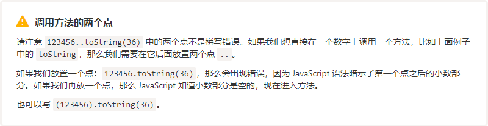
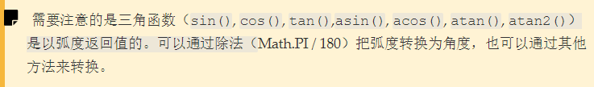

# Link
1. [JavaScript.info - Numbers](https://zh.javascript.info/number)
2. [MDN - Math](https://developer.mozilla.org/zh-CN/docs/Web/JavaScript/Reference/Global_Objects/Math)

# 数字类型 Number

- 直接使用数字字面量创建数字
- 使用 `Number(value)` 函数创建数字字面量，它会对参数进行隐式转化成数字，同时，只包含空格的字符串也会被转换成 **0**
- 将字符串转成数字: `+数字字符串`，效果与 `Number(value)` 等同
- 包装对象装字面量：`new Number(value)` 创建包装对象，在对该对象使用运算符就能转成数字字面量

## 一、科学计数法
```javascript
let billion = 1e9; // 1,000,000,000
let _num = 7.3e9;  // 7,300,000,000

let ms = 1e-6; // 0.000001
1.23e-6 = 1.23 / 1,000,000 //(=0.00000123)
```

## 二、进制
- 十进制
- 二进制：`0b`
- 八进制：`0o`
- 十六进制：`0x`
- 三十六进制

## 三、数字字面量调用函数
`123.toString()` 这种形式会报错，以为JS引擎认为数字后面的第一个点(`.`) 是小数点
1. 数字字面量直接调用方法，如果没有小数点，需要使用 `..` 调用，第一个 **.** 表示小数点，
2. 如果数字中已经包含了小数点，则正常使用 `.` 调用
3. 对于 **非十进制** 的数字，则使用一个 `.` 正常调用方法
4. 对于所有的数字字面量，可用加上括号再调用方法



## 四、toString(base)
`Number.prototype.toString` 方法有一个可选参数 `base`，表示以指定的进制输出数字字符串，`base` 的取值范围为 *2~36*，默认值是10(十进制)

```javascript
10086..toString() //"10086"
10086..toString(2) //"10011101100110"
10086..toString(4) //"2131212"
10086..toString(8) //"23546"
10086..toString(10) //"10086"
10086..toString(15) //"2ec6"
10086..toString(16) //"2766"
10086..toString(24) //"hc6"
10086..toString(30) //"b66"
10086..toString(36) //"7s6"
```

## 五、数值修约规则(rounding)
### 1. Math 方法
1. 向下取整：`Math.floor`，可以认为是去除小数部分
2. 向上取整：`Math.ceil`，当小数部分大于0时，取整数部分加1
3. 四舍五入取整：`Math.round`，根据小数点后第一位四舍五入取整
4. 删除小数点部分：`Math.trunc`

### 2. Number.prototype 方法
1. 指定小数点后四舍五入保留位数：`Number.prototype.toFixed(digits)`，当小数点后位数不够时，会自动补零，但是该方法返回的结果是一个字符串
```javascript
let num = 12.34;
let _num = num.toFixed(5); // _num = ""12.34000""
+_num //12.34
Number(_num) //12.34
```

## 六、不精确计算
> 在 js 内部，一个数字以 64 位格式 IEEE-754 表示，所以正好有 64 位可以存储一个数字：其中 52 个被使用存储这些数字，其中 11 个存储小数点的位置（它们对于整数为零），1 位用于符号。

### 1. 无限 Infinity
如果一个数字太大，它会溢出 64 位存储，可能会输出无穷大
```javascript
1e400 // Infinity
1e308 // 1e308
1e309 // Infinity

1.2323232134554e309 // Infinity
1.2323232134554e+308 // 1.2323232134554e+308
```

### 2. 小数精度
正如十进制无法算尽 **1/3** 一样，像 **1/10** 这样的数在二进制中也是不能算尽的

> 数字格式 IEEE-754 通过四舍五入到最接近的可能数字来解决此问题。这些舍入规则通常不允许我们看到 极小的精确度损失，因此我们看到的数字可能是正确的。但要小心，损失依然存在。

```javascript
0.1.toFixed(20) // "0.10000000000000000555"
0.2.toFixed(20) // "0.20000000000000001110"
0.3.toFixed(20) // "0.29999999999999998890"
0.4.toFixed(20) // "0.40000000000000002220"
0.5.toFixed(20) // "0.50000000000000000000"
0.55.toFixed(20) // "0.55000000000000004441"
0.6.toFixed(20) // "0.59999999999999997780"
0.7.toFixed(20) // "0.69999999999999995559"
0.8.toFixed(20) // "0.80000000000000004441"
0.9.toFixed(20) // "0.90000000000000002220"

0.1 + 0.2 // 0.30000000000000004
0.3.toFixed(20) // "0.29999999999999998890"
0.1 + 0.2 === 0.3 // false
0.1 + 0.2 > 0.3 // true
```
**解决方案：**
1. 根据实际需求，使用 `toFixed` 将要比较或运算的数保留到同样的小数位数
```javascript
(0.1 + 0.2).toFixed(2) === (0.3).toFixed(2) // true
```
2. 先将数字全部转换成整数，运算后再转成小数
```javascript
(0.1 * 10 + 0.2 * 10)/10 == 0.3 // true
```
3. 将数字存储的位数降低，比如以 **元** 为单位可以改成以 **分** 为单位，这样就可以避开小数运算

## 七、Infinity and NaN
**定义：**
- `Infinity`（和 `-Infinity`）是一个特殊的数值，比任何数值都大（小）。
- `NaN` 代表一个错误数字。

**比较：**
- `Infinity` 可以进行正常的比较
- `NaN` 无法进行比较，即使是一个值为 `NaN` 的变量，它都不会等于它自身

```javascript
Infinity === Infinity // true
Infinity === --Infinity // true

NaN === NaN // false
let nan = NaN
nan === nan // false

NaN === Infinity // false
```

**判断：**
1. `isNaN(value)`：可以接受任何类型的参数，会将参数转换成数字，再判断是不是 `NaN`，但是 `boolean`，`""`, `空白字符串`，`null`，`undefined` 都能转化成数字 **0** 或 **1**
2. `isFinite(value)`: 可以接受任何类型的参数，会将参数转换成数字，再判断是不是 `NaN`，`Infinity`，`-Infinity` 以外的常规数字，但是 `boolean`，`""`, `空白字符串`，`null`，`undefined` 都能转化成数字 **0** 或 **1**
3. `Object.is(v1, v2)`：可以判断两个参数是否相等(使用`===`)，包括 `NaN`：`Object.is(NaN, NaN) === true`，但是有一个例外，**0** 和 **-0**: `Object.is(0, -0) === false`

## 八、提取数字
使用 `parseInt()` 或 `parseFloat()` 可以从字符串中提取出数字来，返回的十进制的，但是这样的字符串有一定的要求
1. 从头提取，即如果函数识别字符串的一个字符无法转换成为数字的一部分，那么久认为取法提取出数字，返回 `NaN`
2. 函数直到遇到第一个无法转换成数字成分的字符，就回停止处理，返回之前或提取转化的数字

`parseInt(value, ?radix)` 有两个参数，第二个参数是指使用指定进制提取数字，但返回结果还是十进制；默认情况下，函数能自动识别十进制和十六进制的数字，其他进制的需要使用 `radix` 参数；如果字符串中包含 `0b`、`0o`、`0x`，只有十六进制能正确处理 `0x` 前缀，而二进制、八进制就不能
```javascript
parseInt('100px') // 100
parseInt('h5') // NaN
parseInt('dfdfdf') // NaN
parseInt('0xdfdfdf') // 14671839
parseInt('0b101') // 0
parseInt('0o1237') // 0
parseInt('0b101', 2) // 0
parseInt('101', 2) // 5
parseInt('0o1237', 8) // 0
parseInt('1237', 8) // 671
parseInt('dfdfdf', 16) // 14671839
parseInt('0xdfdfdf', 16) // 14671839
parseInt('0xdfdfdf', 36) // 72645698067
```

## 九、部分数字相关函数
1. `Math.random()`：产生 **[0, 1)** 之间的随机数
2. `Math.max(...args)`：提取最大值，自动隐式转化，参数包含 `NaN` 时返回 `NaN`
3. `Math.min(...args)`：提取最小值，自动隐式转化，参数包含 `NaN` 时返回 `NaN`
4. `Math.pow(n, power)`：指数运算，`n` 为底数，`power` 为指数


## Math 对象
> `Math` 是一个内置对象， 它具有数学常数和函数的属性和方法。不是一个函数对象。

### 1. 常量
- `Math.E` : **欧拉常数**，也是自然对数的底数, 约等于 **2.718**.
- `Math.LN2` : 2 的自然对数, 约等于 **0.693**.
- `Math.LN10` : 10 的自然对数, 约等于 **2.303**.
- `Math.LOG2E` : 以 2 为底 E 的对数, 约等于 **1.443**.
- `Math.LOG10E` : 以 10 为底 E 的对数, 约等于 **0.434**.
- `Math.PI` : **圆周率**，一个圆的周长和直径之比，约等于 **3.14159**.
- `Math.SQRT1_2` : 1/2 的平方根, 约等于 **0.707**.
- `Math.SQRT2` : 2 的平方根,约等于 **1.414**.

```javascript
Math.PI  // 3.141592653589793
Math.E  // 2.718281828459045
Math.LN2  // 0.6931471805599453
Math.LN10  // 2.302585092994046
Math.LOG2E  // 1.4426950408889634
Math.LOG10E  // 0.4342944819032518
Math.SQRT2  // 1.4142135623730951
Math.SQRT1_2  // 0.7071067811865476
```

### 2. 方法
**精度问题：**


- `Math.abc(x)` : 取绝对值
- `Math.exp(x)` : 返回 **E^x**, 当x为参数,  **E** 是欧拉常数, 自然对数的底.
- `Math.log(x)` : 返回一个数的自然对数（**loge**， 即 **ln**）.
- `Math.max(...args)` : 返回0个到多个数值中最大值.
- `Math.min(...args)` : 返回0个到多个数值中最小值.
- `Math.pow(x,y)` : 幂运算，返回 x 的 y 次幂.
- `Math.sqrt(x)` : 返回x的平方根.

**三角函数：使用弧度制**



- `Math.acos(x)` : **arccos**, 返回x的反余弦值.
- `Math.asin(x)` : **arcsin**, 返回x的反正弦值.
- `Math.atan(x)` : **arctan**, 以介于 -PI/2 与 PI/2 弧度之间的数值来返回 x 的反正切值.
- `Math.atan2(y, x)` : 返回 y/x 的反正切值.
- `Math.cos(x)` : **cos**, 返回x的余弦值.
- `Math.sin(x)` : **sin**, 返回正弦值.
- `Math.tan(x)` : **tan**, 返回x的正切值.

```javascript
Math.sin((1/6) * Math.PI)  // 0.49999999999999994
Math.tan((1/4) * Math.PI) // 0.9999999999999999
```
