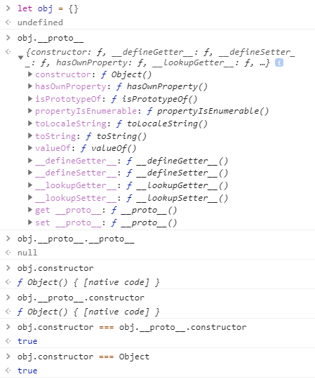

# 原型链


## Link
1. [陌上寒Blog - 关于javascript的原型和原型链，看我就够了](https://www.qdtalk.com/2018/11/03/)
2. [MDN - Object.defineProperty()](https://developer.mozilla.org/zh-CN/docs/Web/JavaScript/Reference/Global_Objects/Object/defineProperty)
3. [Blog - 三张图搞懂JavaScript的原型对象与原型链](https://www.cnblogs.com/shuiyi/p/5305435.html)
4. [A Definitive Guide to JavaScript Prototypes](https://hackernoon.com/a-definitive-guide-to-javascript-prototypes-2c263788021e)
5. [JavaScript.info - Prototypes, inheritance](http://javascript.info/prototypes)

## 1. 创建对象的方式
1. 对象直接量：即使用 `{x:0, y:1}` 的形式，直接使用花括号创建和初始化对象
2. 通过 `new` 创建对象：使用 `new` 构造函数创建并初始化对象
3. 通过 `Object.create()` 创建对象：`Object.create()` 函数包含两个参数，第一个是对象的 **原型**，第二个是对象的属性及其属性描述符：
    ```javascript
    const obj = Object.create({x:1})//obj 继承了属性x

    const obj2 = Object.create(
        Object.prototype,
        {
            foo: {
                writable: true,
                configurable: true,
                value: "hello"
            }
        }
    )
    console.log(obj2); // {foo:"hello"}

    const obj3 = Object.create(null)//obj3 不继承任何属性和方法
    ```
    第二个参数主要包括 `configurable`、`enumerable`、`value`、`writable`、`get`、`set` 等可配置的参数，它们被称为 **属性描述符**，详细信息可参考 [MDN - Object.defineProperty()](https://developer.mozilla.org/zh-CN/docs/Web/JavaScript/Reference/Global_Objects/Object/defineProperty)

## 2. prototype vs. \__proto__ vs. constructor
- `prototype`: 原型
- `__proto__`: 原型链
- `constructor`: 构造方法

在JavaScript中，一切皆对象，每个对象都有一个 `__proto__` 属性和一个 `constructor` 属性(`null` `undefine` 除外)，而只有函数才有 `prototype` 属性

所以，函数同时具有 `prototype`、`__proto__`、`constructor` 三个属性，而非函数对象只有 `__proto__` 和`constructor`


### 2.1 从普通对象 `{}` 说起
  

*总结*：  
```javascript
let obj = {}
 obj.__proto__.constructor === obj.constructor === Object
```

1. `prototype` 和 `__proto__` 都是指向一个非函数对象或 `null`
2. `constructor` 是指向一个函数
3. 一个函数的 `prototype` 的 `constructor` 属性指向该函数本身
4. 函数的 `prototype` 属性指向的对象类似于 **一个抽象类**，它定义使用该函数作为构造方法时创建的对象所拥有的所有方法，使用该函数构造的对象的 `__proto__` 属性就指向这个 **抽象类**
5. 对象的 `__proto__` 属性指向的对象就类似于
6. 所有函数的 `__proto__` 属性都指向 **ƒ () { [native code] }**，所以可以认为讨论函数的 `__proto__` 属性没有多大意义
7. `constructor` 直接指向 `Function` 函数的对象，就有 `prototype` 属性，但是对象无法直接修改 `constructor` 属性，而是只能通过修改 `__proto__` 来修改 `constructor`

### 2.2 不同类型对象的原型链
#### 2.2.1 Object


#### 2.2.2 Number


#### 2.2.2 Function


讨论函数的 `prototype`(原型)，只有在当函数当成构造方法时才有意义；函数 `prototype` 决定了使用该函数构建的对象所具有的属性和方法，就相当于是对象的模板，而对象的 `__proto__` 则正好是指向这个模板；在 `prototype` 模板对象中，对外保留的一个用于创建对象的接口，就是它的 `constructor` 属性，即构造方法

对于每一个函数，都有自己 `prototype` 对象；  
默认情况下，函数的 `prototype` 属性仅包含 `constructor` 和 `__proto__` 属性，`constructor` 属性指向该函数本身，而 `__proto__` 指向 `Object.prototype`，此时可以新增或修改函数的 `prototype` 对象的属性，来改变创建对象的模板

对象的原型(`__proto__`) 只能是 `null` 或者是 **对象**， 而不能是字符串或者数字，布尔值这些基本类型，而在对 `__proto__` 进行直接赋值时，覆盖赋值的是基本类型，JS引擎会直接忽略本次操作；`__proto__` 属性也只是 `constructor.prototype` 的一个getter/setter 而已，所以 `prototype` 的setter本身就对赋值的数据类型做了检查

使用 `Object.create(_prototype)` 可以将指定对象作为原型创建对象，同时也允许 `Object.create(null)` 的操作，这种方式创建的对象没有 `__proto__` 属性，即它的原型是 `null`，这就跟 `Object.prototype` 类似，对于这种没有 `__proto__` 属性的对象，我们就可以为它的 `__proto__` 赋任何类型的值

JavaScript 内置函数的原型关系：


不再使用 `__proto__`:  


`Object.getPrototypeOf(obj)`  
`Object.setPrototypeOf(obj, _prototype)`  
`Object.create(_prototype)`
