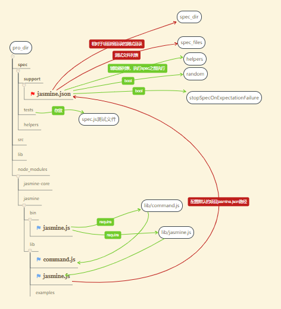

# Jasmine for Node JS

## install and use Jasmine

1.  Add Jasmine to your package.json  
     **use local install**

    > npm install --save-dev jasmine

    **use global install**

    > npm install -g jasmine

2.  Use `jasmine` command

    - `jasmine`: use global install
    - `node node_modules/jasmine/bin/jasmine`: use locally install, we should find the jasmine file

3.  Initialize Jasmine in your project

    > node node_modules/jasmine/bin/jasmine `init`

    > jasmine `init`

4.  Set jasmine as your test script in your package.json

```json
"scripts": { "test": "jasmine" }
```

5.  Run your tests

    > npm test

    > jasmine

    > node node_modules/jasmine/bin/jasmine.js

    // run specific test file

    > jasmine spec/appSpec.js

6.  Generate `example` spec and source files by Jasmine
    > jasmine examples

## Jasmine project structure



- `spec` folder: `spec`在 Jasmine 中是`测试用例`的意思，`spec`文件夹用于存放测试文件和测试配置文件的目录，其中重要的文件就是`support/jasmine.json`
- `support` folder: `spec`的子目录，存放`jasmine.json`文件，之所以要有这一级目录，是因为 Jasmine 的源文件中指明了要在项目的`spec/support`目录下找`jasmine.json`文件
- `jasmine.json`: 项目中 jasmine 的配置文件，在**Configuration**中介绍

## Configuration

```javascript
{
    // Spec directory path relative to the current working dir when jasmine is executed.
    "spec_dir": "spec",

    // Array of filepaths (and globs) relative to spec_dir to include
    "spec_files": [
    "**/*[sS]pec.js"
    ],

    // Array of filepaths (and globs) relative to spec_dir to include before jasmine specs
    "helpers": [
    "helpers/**/*.js"
    ],

    // Stop execution of a spec after the first expectation failure in it
    stopSpecOnExpectationFailure: false,

    // Run specs in semi-random order
    random: false
}
```

- 使用一颗星`*`表示匹配任意字符；使用两颗星`**`则可以匹配任意目录
- 完成 Jasmine 的配置后，在编写测试文件时，无需引入 jasmine 的模块

## API

```javascript
describe("A suite is just a function", () => {
  let a
  it("and so is a spec", () => {
    a = true
    expect(a).toBe(true)
  })
})
```

### describe (description, specDefinitions)

Create a group of specs (often called a suite).  
Calls to describe can be nested within other calls to compose your suite as a tree.  
**Parameters:**

| Name            | Type     | Description                                                            |
| :-------------- | :------- | :--------------------------------------------------------------------- |
| description     | String   | Textual description of the group                                       |
| specDefinitions | function | Function for Jasmine to invoke that will define inner suites and specs |

### it (description, testFunction, timeout)

Define a single spec. A spec should contain one or more expectations that test the state of the code.  
A spec whose expectations all succeed will be passing and a spec with any failures will fail.  
**Parameters:**

| Name         | Type                   | Attributes | Description                                                                             |
| :----------- | :--------------------- | :--------- | :-------------------------------------------------------------------------------------- |
| description  | String                 |            | Textual description of what this spec is checking                                       |
| testFunction | implementationCallback | optional   | Function that contains the code of your test. If not provided the test will be pending. |
| timeout      | Int                    | optional   | Custom timeout for an async spec.                                                       |

### expect (actual) → {matchers}

Create an expectation for a spec.  
**Parameters:**

| Name   | Type   | Description                                         | Return   |
| :----- | :----- | :-------------------------------------------------- | :------- |
| actual | Object | Actual computed value to test expectations against. | matchers |

#### `matchers` API

- toBe(expected)
- toBeFalsy() && toBeTruthy()
- toBeGreaterThan(expected) && toBeGreaterThanOrEqual(expected)
- toBeLessThan(expected) && toBeLessThanOrEqual(expected)
- toBeNaN() && toBeNull() && toBeUndefined()
- toContain(expected)
- toEqual(expected)
- toHaveBeenCalled() && toHaveBeenCalledWith(...args)
- toHaveBeenCalledBefore(expected)
- toHaveBeenCalledTimes(expected)
- toThrow(expected) && toThrowError(expected, message)

#### expectAsync(actual) → {async-matchers}
---

### beforeAll (function, timeout)

### beforeEach (function, timeout)

### afterEach (function, timeout)

### afterAll (function, timeout)

thoes will be executed for each inner describe spec too.  
excute order: `beforeAll`->`beforeEach`->`afterEach`->`afterAll`

### this

对于每一个 `beforeEach`-`it`-`afterEach` 的组合，共享一个`this`，即不同的`it`之间的`this`是不同的

### fail (errorMsg)

Explicitly mark a spec as failed.  
**Parameters:**

| Name     | Type         | Attributes | Description             |
| :------- | :----------- | :--------- | :---------------------- |
| errorMsg | String/Error | optional   | Reason for the failure. |
---

### xdescribe (description, specDefinitions)

A temporarily disabled describe.  
Specs within an xdescribe will be marked pending and not executed.  
`beforeAll`,`beforeEach`,`afterEach`,`afterAll` all will not work  
**Parameters:**

| Name            | Type     | Description                                                            |
| :-------------- | :------- | :--------------------------------------------------------------------- |
| description     | String   | Textual description of the group                                       |
| specDefinitions | function | Function for Jasmine to invoke that will define inner suites and specs |

### xit (description, testFunction)

A temporarily disabled it  
The spec will report as pending and will not be executed.
`beforeAll`,`beforeEach`,`afterEach`,`afterAll` all will not work  
**Parameters:**

| Name         | Type                   | Attributes | Description                                                         |
| :----------- | :--------------------- | :--------- | :------------------------------------------------------------------ |
| description  | String                 |            | Textual description of what this spec is checking.                  |
| testFunction | implementationCallback | optional   | Function that contains the code of your test. Will not be executed. |

### pending (reasonMsg)

Mark a spec as pending, expectation results will be ignored.  
`beforeAll`,`beforeEach`,`afterEach`,`afterAll` are woring, but expectations are not working
**Parameters:**

| Name    | Type   | Attributes | Description                 |
| :------ | :----- | :--------- | :-------------------------- |
| message | String | optional   | Reason the spec is pending. |

---

### spyOn (obj, methodName) → {Spy}

Install a spy onto an existing object.  
**Parameters:**

| Name       | Type   | Description                                   | Return |
| :--------- | :----- | :-------------------------------------------- | :----- |
| obj        | Object | The object upon which to install the Spy.     |
| methodName | String | The name of the method to replace with a Spy. | Spy    |

### Class: Spy

**namespace**：call, and

#### `call` API:
Uesd by Spy   

- any()
- saveArgumentsByValue()
- first()
- all()
- allArgs()
- argsFor(index)
- count() → {Integer}  
Get the number of invocations of this spy.
- mostRecent()
- reset()

#### `and` API

- returnValue(value)
- returnValues(…values)
- throwError(something)
- identity()
- exec()

## static API


### jasmine.createSpy (name, originalFn)

Create a bare Spy object. This won't be installed anywhere and will not have any implementation behind it.  
**Parameters:**

| Name       | Type     | Attributes | Description                                                       |
| :--------- | :------- | :--------- | :---------------------------------------------------------------- |
| name       | String   | optional   | Name to give the spy. This will be displayed in failure messages. |
| originalFn | function | optional   | Function to act as the real implementation.                       |

```javascript
describe("A spy, when created manually", () => {
  let whatAmI
  beforeEach(() => {
    whatAmI = jasmine.createSpy("myName")
    // "myName" will be showed when spec fails
  })
  it("tracks that the spy was called", () => {
    whatAmI("I", "am", "a", "spy")
    expect(whatAmI).toHaveBeenCalledTimes(2)
  })
})
```

### jasmine.createSpyObj (name, methodNames) → {Object}

Create an object with multiple Spys as its members.  
**Parameters:**

| Name        | Type                  | Attributes | Description                                                          |
| :---------- | :-------------------- | :--------- | :------------------------------------------------------------------- |
| name        | String                | optional   | Base name for the spies in the object.                               |
| methodNames | Array.[String]/Object |            | Array of method names to create spies for, or Object whose keys will |

```javascript
describe("Multiple spies, created by createSpyObj", () => {
  let tape = jasmine.createSpyObj("tapeName", ["play", "pause", "stop"])
  it("creates spies for each requested function", () => {
    tape.play()
    tape.pause(1)
    tap.stop()
    expect(tape.play).toBeDefined()
    expect(tape.pause).toBeDefined()
    expect(tape.stop).toHaveBeenCalled()
  })
})
```
***

### jasmine.any (clazz)

Sometimes you don't want to match with exact equality.  
Get a matcher, usable in any matcher that uses Jasmine's equality (_e.g._ `toEqual`, `toContain`, or `toHaveBeenCalledWith`), that will succeed if the actual value being compared is an instance of the specified class/constructor(_e.g._ `String`, `Number`,`Boolean` or `Object`).  
It can't be use in `toBe` but `toEqual` is OK.  
**Parameters:**

| Name  | Type        | Description                       |
| :---- | :---------- | :-------------------------------- |
| clazz | Constructor | The constructor to check against. |

```javascript
class Person {
  constructor(name) {
    this.name = name
  }
}
describe("jasmine.any", () => {
  it("matches any value", () => {
    let quinn = new Person("Quinn")
    expect({}).toEqual(jasmine.any(Object))
    expect(12).toEqual(jasmine.any(Number))
    expect(true).toEqual(jasmine.any(Boolean))
    expect(quinn).toEqual(jasmine.any(Person))
  })
  describe("when used with a spy", () => {
    it("is useful for comparing arguments", () => {
      var foo = jasmine.createSpy("foo")
      foo(12, () => true)
      expect(foo).toHaveBeenCalledWith(
        jasmine.any(Number),
        jasmine.any(Function)
      )
    })
  })
})
```

### jasmine.anything()

Get a matcher, usable in any matcher that uses Jasmine's equality (_e.g._ `toEqual`, `toContain`, or `toHaveBeenCalledWith`), that will succeed if the actual value being compared is not `null` and not `undefined`.  
It can't be use in `toBe` but `toEqual` is OK.   

```javascript
describe("jasmine.anything", () => {
  it("matches anything", () => {
    expect(1).toEqual(jasmine.anything())
  })
  it("matcher to null or undefined", () => {
    expect(null).not.toEqual(jasmine.anything())
    expect(undefined).not.toEqual(jasmine.anything())
  })
  describe("when used with a spy", () => {
    it("is useful when the argument can be ignored", () => {
      var foo = jasmine.createSpy("foo")
      foo(12, () => false)
      expect(foo).toHaveBeenCalledWith(12, jasmine.anything())
    })
  })
})
```

### jasmine.objectContaining (keyValueObj)

varify specific key/value pairs in the given Json object.  
jasmine.objectContaining is for those times when an expectation only cares about certain key/value pairs in the actual.  
Return an object with given key/value pair.

```javascript
describe("jasmine.objectContaining", () => {
  var foo = { a: 1, b: 2, bar: "baz" }
  it("matches objects with the expect key/value pairs", () => {
    expect(foo).toEqual(jasmine.objectContaining({ bar: "baz" }))
    expect(foo).not.toEqual(jasmine.objectContaining({ b: 3 }))
  })
  describe("when used with a spy", () => {
    it("is useful for comparing arguments", () => {
      var callback = jasmine.createSpy("callback")
      callback({ bar: "baz" })
      expect(callback).toHaveBeenCalledWith(
        jasmine.objectContaining({ bar: "baz" })
      )
    })
  })
})
```

### jasmine.arrayContaining (array)

varify specific array all within the given array.  
jasmine.arrayContaining is for those times when an expectation only cares about some of the values in an array.  
Return a Array with the given sub-array.

```javascript
describe("jasmine.arrayContaining", () => {
  var foo = [1, 2, 3, 4]
  it("matches arrays with some of the values", () => {
    expect(foo).toEqual(jasmine.arrayContaining([3, 1]))
    expect(foo).not.toEqual(jasmine.arrayContaining([6, 4]))
    expect(foo).toEqual(jasmine.arrayContaining([6, 4]))
  })
  describe("when used with a spy", () => {
    it("is useful when comparing arguments", () => {
      var callback = jasmine.createSpy("callback")
      callback([1, 2, 3, 4])
      expect(callback).toHaveBeenCalledWith(jasmine.arrayContaining([4, 2, 3]))
      expect(callback).not.toHaveBeenCalledWith(
        jasmine.arrayContaining([5, 2])
      )
    })
  })
})
```

### jasmine.stringMatching (str)

jasmine.stringMatching is for when you don't want to match a string in a larger object exactly, or match a portion of a string in a spy expectation.  
The `str` parameter supports regular expression.  
Return a string with the given sub-string.

```javascript
describe("jasmine.stringMatching", () => {
  it("matches as a regexp", () => {
    expect({ foo: "bar" }).toEqual({ foo: jasmine.stringMatching(/^bar$/) })
    expect({ foo: "foobarbaz" }).toEqual({
      foo: jasmine.stringMatching("bar")
    })
  })
  describe("when used with a spy", () => {
    it("is useful for comparing arguments", () => {
      var callback = jasmine.createSpy("parameter")
      callback("foobasbaz")
      expect(callback).toHaveBeenCalledWith(jasmine.stringMatching("bas"))
      expect(callback).not.toHaveBeenCalledWith(jasmine.stringMatching(/bar/))
    })
  })
})
```

### asymmetricMatch

Custom asymmetric equality tester.  
When you need to check that something meets a certain criteria, without being strictly equal, you can also specify a custom asymmetric equality tester simply by providing an object that has an `asymmetricMatch` function.
The return of `asymmetricMatch` will be transfered into Boolean.  
The name of the object can be meanful for the expectation.

```javascript
var barStringAtSecondWord = {
  asymmetricMatch: function(actual) {
    return actual.split(",")[2] === "bar"
  }
}
```

```javascript
describe("custom asymmetry", () => {
  var barStringAtSecondWord = {
    asymmetricMatch: function(actual) {
      var secondValue = actual.split(",")[2]
      return secondValue === "bar"
    }
  }

  it("dives in deep", () => {
    expect("foo,bar,baz,quux").toEqual(barStringAtSecondWord)
  })

  describe("when used with a spy", () => {
    it("is useful for comparing arguments", () => {
      var callback = jasmine.createSpy("callback")
      callback("foo,bar,baz")
      expect(callback).toHaveBeenCalledWith(barStringAtSecondWord)
    })
  })
})
```
***

### jasmine.clock() → {Clock}
Get the currently booted mock {Clock} for this Jasmine environment.  
It can deal with `setTimeout` and `setInterval` those async function.  
### Clock API
* install() → {Clock}  
Install the mock clock over the built-in methods.
It will listen to timers and know when they starting.
* uninstall()  
Uninstall the mock clock, returning the built-in methods to their places.
* tick(millis)  
Tick the Clock forward, running any enqueued timeouts along the way.  
Simulatie the time forward.  
Timers forwarding just base on the `tick` time.  
* mockDate(initialDate)  
Instruct the installed Clock to also mock the date returned by `new Date()`.  
If you do not provide a initial time, it will use the current date.  
* withMock(Function)  
Execute a function with a mocked Clock  
The clock will be `installed` before the function is called and `uninstalled` in a `finally` after the function completes.

When use `jasmine.clock()`, we should call `jasmine.clock().install()`. And after a spec should reset Clock by `jasmine.clock().uninstall()`

**tick**
```javascript
describe("Manually ticking the Jasmine Clock", () => {
    var timerCallback
    beforeEach(() => {
        timerCallback = jasmine.createSpy("timerCallback")
        // statrt time
        jasmine.clock().install()
    })
    // end time
    afterEach(() => { jasmine.clock().uninstall() })
    it("causes a timeout to be called synchronously", () => {
        setTimeout(() => { timerCallback() }, 100)
        expect(timerCallback).not.toHaveBeenCalled()
        jasmine.clock().tick(101)
        expect(timerCallback).toHaveBeenCalled()
    })
    it("causes an interval to be called synchronously", () => {
        setInterval(() => { timerCallback() }, 100)
        expect(timerCallback).not.toHaveBeenCalled()
        console.log(jasmine.clock())
        jasmine.clock().tick(101)
        expect(timerCallback.calls.count()).toEqual(1)
        jasmine.clock().tick(50)
        expect(timerCallback.calls.count()).toEqual(1)
        jasmine.clock().tick(50)
        expect(timerCallback.calls.count()).toEqual(2)
    })
})
```

**mock time**
```javascript
describe("Mocking the Date object", () => {
    it("mocks the Date object and sets it to a given time", () => {
        jasmine.clock().install()
        var baseTime = new Date(2013, 9, 23)
        jasmine.clock().mockDate(baseTime)
        jasmine.clock().tick(50)
        expect(new Date().getTime()).toEqual(baseTime.getTime() + 50)
        jasmine.clock().uninstall()
    })
})
```

## Asynchronous Support
### Using callbacks
Calls to beforeAll, afterAll, beforeEach, afterEach, and it can take an optional single argument that should be called when the async work is complete.Usually the single argument is named `done`.  
1. This `it spec` will not start until the `done` function is called in the call to `beforeEach` above.  
2. And this spec will not complete until its `done` is called.
3. It means we call `done` in callback function and it should also call `done` in the end of spec.
4. I a spec, we called `done` to indicate the asynchronous function ended.
5. The default time out of Jasmine is 5s, and set `jasmine.DEFAULT_TIMEOUT_INTERVAL` to change it.

```javascript
// callback and done
  describe("Using callbacks", () => {
    beforeEach(function(done) {
        let value = 1
      setTimeout(() => {
        value = 2
        // it spec will execute until done is called
        done()
        // console.log() will be excuted after spec
        console.log("beforeEach")
      }, 1)
    })
    // This spec will not start until the done function is called in the call to beforeEach above.
    it("should support async execution of test preparation and expectations", function(done) {
      value++
      expect(value).toBeGreaterThan(2)
      // And this spec will not complete until its done is called.
      done()
    })
  })
```
6. The `done.fail(msg)` function fails the spec and indicates that it has completed.

### test Ajax
We have written a plugin called `jasmine-ajax` that allows ajax calls to be mocked out in tests.  
**1. for npm**  
> npm install --save-dev jasmine-ajax  

`require('jasmine-ajax')` inside test-suite and access it via the jasmine global.   

**2. for browser**  
Download the `mock-ajax.js` file and add it to your jasmine `helpers` so it gets loaded before any specs that use it.

### Promises

### async/await


# test report in browser
### Need:
* node_modules/jasmine-core/images/`jasmine_favicon.png`
* node_modules/jasmine-core/lib/jasmine-core/`jasmine.css`
* node_modules/jasmine-core/lib/jasmine-core/`jasmine.js`
* node_modules/jasmine-core/lib/jasmine-core/`jasmine-html.js`
* node_modules/jasmine-core/lib/jasmine-core/`boot.js`
* my spec test js files

```html
<html>
<head>
  <meta charset="utf-8">
  <title>Jasmine Spec Runner Report</title>

  <link rel="shortcut icon" type="image/png" href="./node_modules/jasmine-core/images/jasmine_favicon.png">
  <link rel="stylesheet" href="./node_modules/jasmine-core/lib/jasmine-core/jasmine.css">

  <script src="./node_modules/jasmine-core/lib/jasmine-core/jasmine.js"></script>
  <script src="./node_modules/jasmine-core/lib/jasmine-core/jasmine-html.js"></script>
  <script src="./node_modules/jasmine-core/lib/jasmine-core/boot.js"></script>

  <script src="./spec/tests/any.spec.js"></script>
  <script src="./spec/tests/pending.spec.js"></script>

</head>

<body>
</body>
</html>
```

# Link
### Writing Jasmine Unit Tests In ES6
http://www.syntaxsuccess.com/viewarticle/writing-jasmine-unit-tests-in-es6
