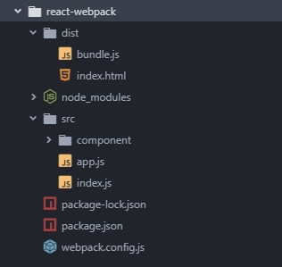
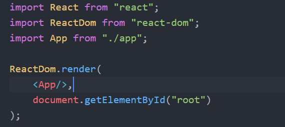
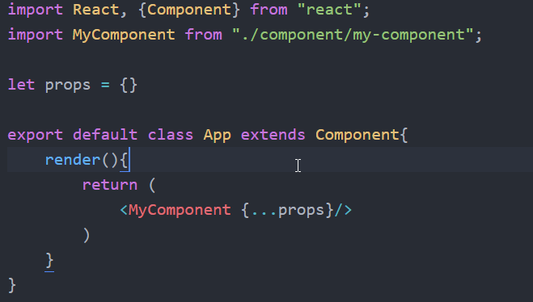

## react module

- react
- react-dom

## 对象和方法

### react

- ReactDOM
  1.  render(component, DOMOnject): 将`component`插入到`DOMOnject`中
- React
  1.  createElement(
      type,
      [props],
      [...children]
      )

## JSX 语法

- 所有 JSX 编写的 HTNL 都是虚拟 DOM 的对象，且每个虚拟 DOM 的对象向都必须有一个根标签
- 在 JSX 中的 JS 代码必须放置在`{}`中，`{}`中若还有 JSX 代码，则其中的 JS 代码还需要继续加`{}`

## 创建组件

1.  工厂函数
    - 返回值的 JSX 标签
    - 方法名大写开头
    - 以`<方法名></方法名>`的形式应用
    - 函数有一个`props`参数
2.  组件类
    - 继承`React.component`
    - 重写`render`方法，返回 JSX 标签
3.  ES5 创建组件
    - 使用`React.createClass`

## React.Component

### 组件的三大属性 `props`, `refs`, `state`

### props

- 只读属性

### refs

- 用于引用真实的 DOM 对象
- 在需要绑定真实 DOM 的组件标签上添加`ref`属性，并指定一个名称
- 使用`this.refs.refName`可以获取指定`refName`绑定的真实 DOM 对象

### state

- 组件的内部数据状态，`state`的修改会触发组件的重新渲染
- 一般在`constructor`中对`state`进行初始化`this.state={...}`
- 只能使用`this,setState`方法对组件的`state`进行修改，方法的参数是一个对象

### 默认 Props

```javascript
ClassName.defaultProps={
    ...
}
```

### Prop 检验

限定组件可传入的 prop 的数据类型以及必要性，但是如果不传入指定的prop并不会fail整个引用，而是会在控制台抛出warning信息

"prop-types"模块的 `PropTypes` 对象，封装了数据类型和约束，可以用于 prop 的数据检测

>npm install --save prop-types

```javascript
import PropTypes from "prop-types";

ClassName.propTypes = {
  optionalArray: PropTypes.array,
  optionalBool: PropTypes.bool,
  optionalNumber: PropTypes.number,
  optionalObject: PropTypes.object,
  optionalString: PropTypes.string,
  optionalMessage: PropTypes.instanceOf(Message),
  optionalEnum: PropTypes.oneOf(["News", "Photos"]),
  requiredFunc: PropTypes.func.isRequired,
  requiredAny: PropTypes.any.isRequired
};
```

### 事件机制

- 事件名称：驼峰命名法，`on`开头
- 事件参数：`event.target`表示触发事件的 DOM 对象

### 状态改变
#### setState(fn|obj)
用于修改组件state的唯一方法，方法的参数的执行结果必须是一个对象，用于更新原有的state，有一下几点注意：
1. 不要直接更新状态，即不可对`this.state`进行直接赋值
2. 状态更新可能是异步的，即尽可能不要在`setState`的fn或obj参数中使用`this.state`和`this.props`，因为它们可能是异步更新的，此时应该使用fn作为参数，方法会传入两个参数，原有的state(preState)和state被更新应用时的props
```javascript
this.setState((prevState, props) => ({
    counter: prevState.counter + props.increment
}));
```
3. 状态更新合并，即在提供新的state是，无需提供完整的state对象，而只需提供需要修改的部分的对象即可，react会自动对原有state和新的state进行浅合并
```javascript
constructor(props) {
super(props);
    this.state = {
        posts: [],
        comments: []
    };
}
componentDidMount() {
    fetchPosts().then(response => {
        this.setState({ posts: response.posts });
    });
}
// state = {posts: response.posts, comments: []}
```

react 控件的状态和各种值是单向改变的，即无法通过在界面修改 UI 来修改虚拟 DOM(除非`setState`)，如：

```javascript
class Controller extends React.Component{
  render(){
    let {msg} = this.state
    return (
      <div>
        <input type="text" value={msg}/>
        <input type="text" value="Hello"/>
      </div>
    )
  }
}
这里的两个输入框的值，是无法通过在页面进行输入来操作的，因此在输入框中输入但是页面是不会变化的，因为没有引起虚拟DOM的改变，因而页面不会自动渲染
```

## component life cycle(组件生命周期)
每一个组件都有几个你可以重写以让代码在处理环节的特定时期运行的“生命周期方法”。方法中带有前缀 `will` 的在特定环节之前被调用，而带有前缀 `did` 的方法则会在特定环节之后被调用。
### 装配阶段
这些方法会在组件实例被创建和插入DOM中时被调用：

1. constructor()
2. static getDerivedStateFromProps()
3. componentWillMount() | UNSAFE_componentWillMount()
4. render()
5. componentDidMount()

### 更新阶段
属性或状态的改变会触发一次更新。当一个组件在被重渲时，这些方法将会被调用：

1. componentWillReceiveProps() | UNSAFE_componentWillReceiveProps()
2. static getDerivedStateFromProps()
3. shouldComponentUpdate()
4. componentWillUpdate() | UNSAFE_componentWillUpdate()
5. render()
6. getSnapshotBeforeUpdate()
7. componentDidUpdate()

### 卸载阶段
当一个组件被从DOM中移除时，该方法被调用：

1. componentWillUnmount()

### 错误处理
在渲染过程中发生错误时会被调用：

1. componentDidCatch()

### API
#### render()
`render()` 函数应该纯净，意味着其不应该改变组件的状态，其每次调用都应返回相同的结果，同时不直接和浏览器交互。若需要和浏览器交互，将任务放在 `componentDidMount()` 阶段或其他的生命周期方法。保持 `render()` 方法纯净使得组件更容易思考。  

可以通过使用一个数组让render()返回多个元素：
```javascript
render() {
  return [
    <li key="A">First item</li>,
    <li key="B">Second item</li>,
    <li key="C">Third item</li>,
  ];
}
```

#### constructor(props)
React组件的构造函数将会在装配之前被调用。当为一个React.Component子类定义构造函数时，你应该在任何其他的表达式之前调用 `super(props)` 。否则，`this.props` 在构造函数中将是未定义，并可能引发异常。

构造函数是初始化状态的合适位置。若你不初始化状态且不绑定方法，那你也不需要为你的React组件定义一个构造函数。

#### static getDerivedStateFromProps(nextProps, prevState)
组件实例化后和接受新属性时将会调用getDerivedStateFromProps。它应该返回一个对象来更新状态，或者返回null来表明新属性不需要更新任何状态。

注意，如果父组件导致了组件的重新渲染，即使属性没有更新，这一方法也会被调用。如果你只想处理变化，你可能想去比较新旧值。

调用 `this.setState()` 通常不会触发 getDerivedStateFromProps()。

#### UNSAFE_componentWillMount()
`UNSAFE_componentWillMount()` 在装配发生前被立刻调用。其在 `render()` 之前被调用，因此在这方法里同步地设置状态将不会触发重渲。

避免在该方法中引入任何的副作用或订阅。对于这些使用场景，我们推荐使用 `constructor()` 来替代。

这是唯一的会在服务端渲染调起的生命周期钩子函数。

> 这一生命周期之前叫做 `componentWillMount`,这一名字在17版前都有效。

#### componentDidMount()
componentDidMount()在组件被装配后立即调用。初始化使得DOM节点应该进行到这里。若你需要从远端加载数据，这是一个适合实现网络请求的地方。在该方法里设置状态将会触发重渲。

这一方法是一个发起任何订阅的好地方。如果你这么做了，别忘了在`componentWillUnmount()`退订。

在这个方法中调用`setState()`将会触发一次额外的渲染，*但是它将在浏览器刷新屏幕之前发生*。这保证了即使`render()`将会调用两次，但用户不会看到中间状态。谨慎使用这一模式，因为它常导致性能问题。然而，它对于像`模态框`和`工具提示框`这样的例子是必须的。这时，在渲染依赖DOM节点的尺寸或者位置的视图前，你需要先测量这些节点。

#### UNSAFE_componentWillReceiveProps(nextProps)
UNSAFE_componentWillReceiveProps()在装配了的组件接收到新属性前调用。若你需要更新状态响应属性改变（例如，重置它），你可能需对比`this.props`和`nextProps`并在该方法中使用`this.setState()`处理状态改变。

注意即使属性未有任何改变，React可能也会调用该方法，因此若你想要处理改变，请确保比较当前和之后的值。这可能会发生在当父组件引起你的组件重渲。

在 装配期间，React并不会调用带有初始属性的UNSAFE_componentWillReceiveProps方法。其仅会调用该方法如果某些组件的属性可能更新。调用`this.setState`通常不会触发该方法。


> 推荐你使用`getDerivedStateFromProps`生命周期而不是UNSAFE_componentWillReceiveProps

> 这一生命周期之前叫做`componentWillReceiveProps`, 这一名字在17版前都有效

#### shouldComponentUpdate(nextProps, nextState)
使用shouldComponentUpdate()以让React知道当前状态或属性的改变是否不影响组件的输出。默认行为是在每一次状态的改变重渲，在大部分情况下你应该依赖于默认行为。

当接收到新属性或状态时，shouldComponentUpdate() 在渲染前被调用。默认为`true`。该方法并不会在初始化渲染或当使用`forceUpdate()`时被调用。

当他们状态改变时，返回`false` 并不能阻止子组件重渲。

当前，若shouldComponentUpdate()返回`false`，而后`UNSAFE_componentWillUpdate()`，`render()`， 和 `componentDidUpdate()`将不会被调用。注意，在未来React可能会将shouldComponentUpdate()作为一个线索而不是一个严格指令，返回false可能仍然使得组件重渲。

在观察后，若你判定一个具体的组件很慢，你可能需要调整其从React.PureComponent继承，其实现了带有浅属性和状态比较的shouldComponentUpdate()。若你确信想要手写，你可能需要用`this.props`和`nextProps`以及`this.state` 和 `nextState`比较，并返回false以告诉React更新可以被忽略。

#### UNSAFE_componentWillUpdate(nextProps, nextState)
当接收到新属性或状态时，UNSAFE_componentWillUpdate()为在渲染前被立即调用。在更新发生前，使用该方法是一次准备机会。该方法不会在初始化渲染时调用。

注意你不能在这调用`this.setState()`，若你需要更新状态响应属性的调整，使用`getDerivedStateFromProps()` 代替。

> 这一生命周期之前叫做`componentWillUpdate`, 这一名字在17版前都有效。

#### getSnapshotBeforeUpdate(prevProps, prevState)
getSnapshotBeforeUpdate()在最新的渲染输出提交给DOM前将会立即调用。它让你的组件能在当前的值可能要改变前获得它们。这一生命周期返回的任何值将会 作为参数被传递给`componentDidUpdate()`。

#### componentDidUpdate(prevProps, prevState)
componentDidUpdate()会在更新发生后立即被调用。该方法并不会在初始化渲染时调用。

当组件被更新时，使用该方法是操作DOM的一次机会。这也是一个适合发送请求的地方，要是你对比了当前属性和之前属性（例如，如果属性没有改变那么请求也就没必要了）。
#### componentWillUnmount()
componentWillUnmount()在组件被卸载和销毁之前立刻调用。可以在该方法里处理任何必要的清理工作，例如解绑定时器，取消网络请求，清理任何在`componentDidMount`环节创建的DOM元素。

#### componentDidCatch(error, info)
错误边界是React组件，并不是损坏的组件树。错误边界捕捉发生在子组件树中任意地方的JavaScript错误，打印错误日志，并且显示回退的用户界面。错误边界捕捉渲染期间、在生命周期方法中和在它们之下整棵树的构造函数中的错误。

如果定义了这一生命周期方法，一个类组件将成为一个错误边界。在错误边界中调用`setState()`让你捕捉当前树之下未处理的JavaScript错误，并显示回退的用户界面。只使用错误边界来恢复异常，而不要尝试将它们用于控制流。

## Component API
### 函数
- setState(updater, [callback])
- forceUpdate(callback)

### 类属性
- defaultProps
- displayName

### defaultProps
defaultProps可以被定义为组件类的一个属性，用以为类设置默认的属性。这对于未定义（undefined）的属性来说有用，而对于设为空（null）的属性并没用。
```javascript
class CustomButton extends React.Component {
    // ...
}
CustomButton.defaultProps = {
    color: 'blue'
};
```

### displayName
displayName被用在调试信息中。JSX会自动设置该值

## 数据传递
同级组件或者非父子关系的组件之间的数据传递是十分困难的事情，而在react官网提供了三种解决方法：
1. 上下文(Context)，但官方比不推荐
2. 事件订阅(event subscribe)
3. redux

# create by webpack

## 1.所需要的依赖

- webpack
- webpack-cli
- webpack-dev-server

> npm install --save-dev webpack webpack-cli webpack-dev-server

- babel-core
- babel-cli
- babel-loader
- babel-preset-env
- babel-preset-react
- babel-preset-stage-1

> npm install --save babel-core babel-cli babel-loader@7 babel-preset-env babel-preset-react babel-preset-stage-1

由于默认安装的 babel-core 和 babel-cli 是`6.x`的版本，而 babel-loader 是`8.x`的版本，这个版本的 babel-loader 需要`7.x`以上的 babel-core，因此要降低 babel-loader 的版本到`7.x`，以适应 babel-core 和 babel-cli。  
babel-preset-stage-1 是用于翻译class中使用箭头函数定义类方法的语法

- css-loader
- style-loader

> npm install --save css-loader style-loader

样式打包的工具，css-loader：遍历加载CSS文件，style-loader：生成style标记

- react
- react-dom

> npm install --save react react-dom

对于bable的模块，若使用`--save-dev`安装，在使用webpack命令打包项目时，很可能出现`babel-loader`找不到的异常而打包失败，此时可以将babel的所有模块卸载，重新使用`--save`选项安装，此时就可以成功执行webpack打包。然后再将所有babel模块重新用`--save-dev`安装，也可以正常工作了。

对于`css-loader`和`style-loader`也有上述的发现。

## 2.项目结构

- node_modules
- dist
  - index.html
  - bundle.js
- src
  - component
  - app.js
  - index.js
- .babelrc
- webpack.config.js
- package.json



## 3.配置文件

### webpack.config.js

```javascript
const path = require("path");

const config = {
  entry: "./src/index.js",
  output: {
    path: path.resolve(__dirname, "dist"),
    filename: "bundle.js"
  },
  module: {
    rules: [
      {
        test: /\.js/,
        use: {
          loader: "babel-loader",
          options: {
            presets: ["env", "react", "stage-1"]
          }
        },
        exclude: /(node_modules|bower_components)/
        },
        // 样式加载器，必须将`css-loader`放在最后，因为use对loader的加载顺序是从后往前的，先遍历加载CSS资源，再生成style标记。
        {
            test: /\.css/,
            use: ["style-loader", "css-loader"],
            exclude: /(node_modules|bower_components)/
        }
    ]
  },
  //开启监听
  watch: true,
  watchOptions: {
    ignored: /node_modules/,
    aggregateTimeout: 2000
  },
  mode: "development",
  devtool: "inline-source-map",//开发调试的工具
  // webpack-dev-server的服务器配置
  devServer: {
    contentBase: "./dist",
    host: "localhost",
    port: 8888
  }
};

module.exports = config;
```

### .babelrc(可选)
若 webpack.config.js 配置 loader 的 `options` ，则可以不需要
```json
{
  "presets": ["env", "react", "stage-1"]
}

```
### package.json
webpack打包项目的命令和运行服务
```json
...
"scripts": {
    "start":"webpack-dev-server --open",
    "build": "webpack --webpack.config.js"
 }
 ...
```

## 4.文件基本结构
### index.html
1. 提供一个App的容器，如：`<div id="root"></div>`
2. 引用webpack打包后的bundle.js文件


### index.js
使用`ReactDOM`将APP组件渲染到index.html的容器中


### app.js
将其他子组件组装成一个app


---
## create-react-app
> npx create-react-app dir

若已安装全局的`create-react-app`模块，则不用npx
> create-react-app dir

## 准备工作

1.  安装 NodeJS
2.  安装 `webpack`

    > npm install -g webpack  
    > npm install -g webpack-cli

3.  初始化项目

    > npm init -y

4.  创建项目目录

- node_module
- src
  - mian.js
- dist
  - bundle.js
- index.html
- package.json
- webpack.config.js

5.  配置`webpack.config.js`

```javascript
const path = require("path");
module.exports = {
  entry: "./src/main.js",
  output: {
    path: path.resolve(__dirname, "dist"),
    filename: "bundle.js"
  },
  watch: true,
  mode: "development"
};
```

## react re-render问题
如果组件只有单纯的 `setState` 引起的state变化，而没有 `props` 的变化，则每次 `setState` 都会引起 `re-render`，不论state的属性是否发生变化。

在 `props` 发生改变的情况下，组件也会 `re-render`.

在 `setState` 的同时，组件的 `props` 也发生变化的情况下，这种变化一般是从父组件发起，在父组件render的时候，传给子组件的 `props` 发生变化，从而引发子组件的 `re-render`，这时，`setState` 引起的 `re-render` 会和 `props` 变化引起的 `re-render` 合并成一个。

## this.props.children
修改children的属性：
### React.cloneElement(element, config, children)
- element: 要被拷贝的元素，可以使children中的一个
- config: 可选参数，表示需要修改的属性，属性和值会被添加到克隆出来的元素的props中，也可以添加 `ref`，`key` 属性
- children: 可选属性，作为克隆的元素的children

# Link
### React Official
https://reactjs.org/
### Create React App Official
https://facebook.github.io/create-react-app/  
test  
https://facebook.github.io/create-react-app/docs/running-tests
### Github
facebook/create-react-app  
https://github.com/facebook/create-react-app
### 阮一峰
React 入门实例教程  
http://www.ruanyifeng.com/blog/2015/03/react.html  
React 技术栈系列教程  
http://www.ruanyifeng.com/blog/2016/09/react-technology-stack.html  
React 测试入门教程  
http://www.ruanyifeng.com/blog/2016/02/react-testing-tutorial.html  
React Router 使用教程  
http://www.ruanyifeng.com/blog/2016/05/react_router.html
