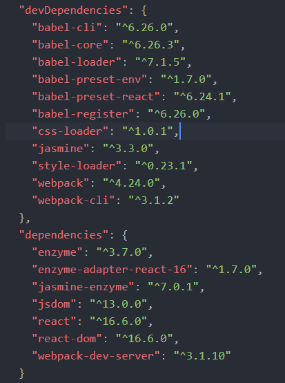
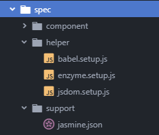

# Enzyme
# 使用Jasmine搭建enzyme的测试环境
## 准备
1. 搭建一个React的开发环境
2. 搭建基本的Jasmine测试环境

## 依赖模块
- enzyme
- jasmine-enzyme
- jsdom
- enzyme-adapter-react-16(针对react 16.x)

enzyme 为react测试提供核心的API  
enzyme-adapter-react-16 enzyme的react适配器，用于向Enzyme配置正确的react版本   
jasmine-enzyme 是jasmine配合enzyme使用的扩增matcher库，增加了许多UI测试的断言API，但不是必须的  
jsdom 由于nodeJS没有DOM环境，jsdom可以提供一个node的DOM环境，用于react构造组件和虚拟DOM  

- react
- react-dom
- babel-core 或 babel-register
- babel-preset-react
- jasmine

这部分依赖是在构建react和jasmine环境是要用到的，同时也是搭建Enzyme测试环境必须的依赖  

Jasmine似乎不支持ES6的一些语法(import)，所以在测试文件开头都要导入`babel-register`或`babel-core\register`进行语法的转码，而`babel-core\register`在Babel 7.x之后就从`babel-core`移除



## 配置
- babel setup
- enzyme setup
- jsdom setup
- style setup

这些配置都是在测试的前期准备，可以理解为`beforeEach`，通过创建相应的配置文件，配置到`jasmine.json`的`helpers`列表中即可  

同时这些配置文件的引入顺序也要按上述的顺序

### babel setup
引入babel对ES6的语法进行翻译

```javascript
// babel.setup.js
require("babel-register");
```
或
```javascript
// babel.setup.js
require("babel-core/register");
/*
"babel-core/register" is same as "babel-register"
Since Babel7.x, "register" was removed from "babel/core"
*/
```

### enzyme setup
配置Enzyme的React适配器  
在每个spec启动前加载jasmine-enzyme

```javascript
//enzyme.setup.js
import jasmineEnzyme from "jasmine-enzyme";
import { configure } from "enzyme";
import Adapter from "enzyme-adapter-react-16";

configure({ adapter: new Adapter() });

beforeEach(function() {
  jasmineEnzyme();
});
```

若不使用jasmine-enzyme，则只需要：
```javascript
//enzyme.setup.js
import { configure } from "enzyme";
import Adapter from "enzyme-adapter-react-16";

configure({ adapter: new Adapter() });
```
### jsdom setup
提供node的DOM环境，若没有DOM环境，enzyme的`mount`和`shallow`无法成功模拟react控件，测试启动会抛异常

```javascript
//jsdom.setup.js
import {JSDOM} from 'jsdom';

const dom = new JSDOM('<html><body></body></html>');
global.document = dom.window.document;
global.window = dom.window;
global.navigator = dom.window.navigator;
```

### style setup
对于Enzyme模拟的组件来说，真正去加载组件中的图片或CSS样式是比较消耗资源，也是没有必要的，因此有一些文件是必须被忽略掉的，否则

`ignore-styles`这么包可以忽略文件中导入的样式文件
> npm install --save-dev ignore-styles

在测试文件中直接导入该模块即可自动忽略CSS样式文件的加载
```javascript
import "ignore-styles";
```

### jasmine.json helpers
将所有setup文件依次添加到jasmine.json的helpers列表中

```json
{    
    "helpers": [
        "helper/babel.setup.js",
        "helper/enzyme.setup.js",
        "helper/jsdom.setup.js",
        "helper/*.js"
    ]
}
```



## 使用Enzyme
在引入被测试的组件之前，必须向引入"react"
```javascript
import React from "react";
import { mount, shallow } from "enzyme";

import TodoList from "../../src/component/todo-list";

describe("todo list", () => {
  let wrapper = {};
  beforeEach(() => {
    wrapper = shallow(<TodoList />);
  });

  it("title", () => {
    //toHaveClassName 和 toHaveClassName 都是jasmine-enzyme的断言API
    expect(wrapper.find("header")).toHaveClassName("title");
    expect(wrapper.find("header")).toHaveText("Todo List");
  });
});
```

## react的jasmine-enzyme开发技术栈
GitHub：https://github.com/Akigaze/react-jasmine-dev-stack

----------------------------
# 脚手架React项目使用enzyme测试
使用`create-react-app`搭建的项目需要将测试文件编写在src目录下，且以`.test.js`为后缀名  

`create-react-app`搭建的react项目默认使用Jest测试框架，要使用Enzyme是需要下载相关依赖：
> npm install --save enzyme enzyme-adapter-react-16 react-test-renderer

再在src目录下放置一个`setupTests.js`文件，类似jasmine的`enzyme.setup.js`:
```javascript
import { configure } from 'enzyme';
import Adapter from 'enzyme-adapter-react-16';

configure({ adapter: new Adapter() });
```

然后就可以使用enzyme的API进行测试了

----------------------------------
# Render mode
-  Shallow Rendering
-  Full Rendering
-  Static Rendering

## Shallow Rendering
> Shallow rendering is useful to constrain yourself to testing a component as a unit, and to ensure that your tests aren't indirectly asserting on behavior of child components.

### shallow(node[, options]) => ShallowWrapper
`shallow` API does call React lifecycle methods such as `componentDidMount` and `componentDidUpdate`.

`shallow`函数时Enzyme进行的浅渲染的函数，它不会对子组件进行渲染，因而可避免子组件对父组件的测试干扰

`ShallowWrapper`对象可以是单个值，也可以是数组的形式

Arguments：
1. node (ReactElement): The node to render
2. options (Object [optional]):
    - options.context: (Object [optional]): Context to be passed into the component
    - options.disableLifecycleMethods: (Boolean [optional]): If set to true, `componentDidMount` is not called on the component, and `componentDidUpdate` is not called after `setProps` and `setContext`. Default to false.

### ShallowWrapper API
#### .find(selector) => ShallowWrapper
Arguments：  
- selector (EnzymeSelector): The selector to match.

selector的类别:

1. CSS Selectors:

    ```javascript
    const wrapper = shallow(<MyComponent />);
    // class select
    wrapper.find('.foo')
    wrapper.find('.bar')

    // id selector
    wrapper.find('#foo')

    // compound selector
    wrapper.find('div.some-class')
    ```

2. Component Constructors:
```javascript
import Foo from '../components/Foo';
wrapper.find(Foo)
```

3. Component Display Name:
```javascript
const wrapper = shallow(<MyComponent />);
expect(wrapper.find('Foo').length).toBe(1);
```
4. Object Property Selector:
```javascript
const wrapper = shallow(<MyComponent />);
expect(wrapper.find({ prop: 'value' })).not.toExist();
```

**---- 注意 ----**  
通过`find`得到的ShallowWrapper对象是完全独立的，是从原有的wrapper对象拷贝出来的，而没有相互的引用，所以，如果外层的wrapper对象因props或state的改变而重新渲染，原来`find`得到的ShallowWrapper对象是不会有任何变化的，需要重新使用`find`获取渲染后的子组件

#### .findWhere(fn) => ShallowWrapper

类似于Array.filterde API ?????  
在Enzyme中也有一个`filterWhere`的API，但这两个貌似功能是一样的 ???

```javascript
const wrapper = shallow(<DemoList />)
let items = wrapper.find(DemoItem);
let enzymes = items.findWhere(i => i.prop("text").includes("Enzyme"));
expect(enzymes.length).toEqual(2);
```

#### .filter(selector) => ShallowWrapper
与`find`相似，一般在find之后使用

#### .filterWhere(predicate) => ShallowWrapper
与`findWhere`相似，一般在find之后使用

### .not(selector) => ShallowWrapper
筛选恰好与`filter`，选出不符合的内容，一般在find之后使用

#### .hostNodes() => ShallowWrapper
> Removes nodes that are not host nodes; e.g., this will only return HTML nodes.

应该是返回原生HTML的标签的对象
```javascript
const wrapper = shallow((
    <div>
        <DemoItem className="foo" test="foo" />
        <p className="foo" id="haha"/>
        <div className="foo" id="hoho"/>
    </div>
));
expect(wrapper.find(".foo").hostNodes().length).toBe(2);
```

#### .contains(nodeOrNodes) => Boolean
Arguments
- nodeOrNodes (ReactElement|Array<ReactElement>): The node or array of nodes whose presence you are detecting in the current instance's render tree.

只有当wrapper对象包含参数中的所有Node元素，才返回true

```javascript
// one ReactElement
expect(wrapper.contains(<div data-foo="foo">Hello</div>)).toEqual(true);
// ReactElement array
expect(wrapper.contains([
  <span>Hello</span>,
  <div>Goodbye</div>,
])).toEqual(true);
```

#### .first() => ShallowWrapper
节点集中的第一个，一般应用于`find`匹配过后的节点集

```javascript
expect(wrapper.find("DemoItem").first().length).toBe(1);
expect(wrapper.find(DemoItem).first().prop("text")).toBe("React");
```

#### .last() => ShallowWrapper
返回节点集中的最后一个节点，一般用于`find`的结果，与`first`相似

#### .prop(key) => Any

根据指定的key，获取wrapper对象想要`props`中的属性值，只用于单一的node节点

> .prop(key) only returns values for props that exist in the root node.

`prop`函数只能获取组件render是使用的props属性，而没有被使用到的无法返回得到；且只有在调用的wrapper对象的根节点上的属性才能被读取到

```javascript
let items = wrapper.find(DemoItem);
expect(items.at(3).prop("text")).toEqual("Jamsine-Enzyme");
```

#### .props() => Object

返回组件的props属性对象，但并不是完整的对象，只有在组件的render方法中使用的prop才会返回

若要返回完整的props，要使用`wrapper.instance().props`

#### .state([key]) => Any
根据key返回state中相应的属性值，若不指定key，则是返回整个state对象
```javascript
const wrapper = shallow(<MyComponent />);
expect(wrapper.state().foo).to.equal(10);
expect(wrapper.state('foo')).to.equal(10);
```

#### .text() => String
返回整个组件中所有的字符串

```javascript
let wrapper = shallow(<div><b>important</b></div>);
expect(wrapper.text()).to.equal('important');

wrapper = shallow(<div>it is <b>important</b>.</div>);
expect(wrapper.text()).to.equal('it is important.');
```

#### .map(fn) => Array<Any>
相当于`Array.map`

#### .forEach(fn) => Self
相当于`Array.forEach`

#### .someWhere(fn) => Boolean
相当于`Array.some`

#### .some(selector) => Boolean
与`someWhere`相似，但只能以选择器作为判断条件

#### .every(selector) => Boolean
只有当wrapper集合中的每一个节点元素都满足指定的选择器是才返回true

```javascript
const wrapper = shallow((
  <div>
    <div className="foo qoo" />
    <div className="foo boo" />
    <div className="foo hoo" />
  </div>
));
expect(wrapper.find('.foo').every('.foo')).toEqual(true);
expect(wrapper.find('.foo').every('.qoo')).toEqual(false);
expect(wrapper.find('.foo').every('.bar')).toEqual(false);
```

#### .everyWhere(fn) => Boolean
与every相似

```javascript
const wrapper = shallow((
  <div>
    <div className="foo qoo" />
    <div className="foo boo" />
    <div className="foo hoo" />
  </div>
));
expect(wrapper.find('.foo').everyWhere(n => n.hasClass('foo'))).toEqual(true);
expect(wrapper.find('.foo').everyWhere(n => n.hasClass('qoo'))).toEqual(false);
expect(wrapper.find('.foo').everyWhere(n => n.hasClass('bar'))).toEqual(false);
```

#### .parent() => ShallowWrapper
> Returns a wrapper with the direct parent of the node in the current wrapper.

```javascript
let item_1 = wrapper.find("DemoItem").at(0);
expect(item_1.parent().is("ul")).toBe(true);
```

#### .parents([selector]) => ShallowWrapper
> Returns a set of wrapper around all of the parents/ancestors of the wrapper. Does not include the node in the current wrapper. Optionally, a selector can be provided and it will filter the parents by this selector.

```javascript
wrapper = shallow(<div><p><span>hello</span>world</p></div>)
expect(wrapper.find("span").parents().length).toBe(2);
expect(wrapper.find("span").parents("p").length).toBe(1);
wrapper.find("span").parents().forEach(p => console.log(p.name())); // p, div
```

#### .at(index) => ShallowWrapper
获取一个 node 集合中指定索引的对象

#### .get(index) => ReactElement
功能与`at`相似，但返回的结果是一个`ReactElement`，无法再使用`find`等方法，但`at`方法依然适用
```javascript
const wrapper = shallow(
  <div>
    <ul>
      <li>1</li>
    </ul>
    <ul>
      <li>3</li>
    </ul>
  </div>
);
let ul_2 = wrapper.find("ul").get(1);
expect(ul_2.find).toBe(undefined);
let lis = wrapper.find("li");
expect(lis.at(2).text()).toBe("3");
```

#### .childAt(index) => ShallowWrapper
与`at`类似

```javascript
wrapper = shallow((
  <div>
      <p><span>hello world</span></p>
      <p>
          <span>hello react</span>
          <span>hello enzyme</span>
      </p>
  </div>
))
expect(wrapper.childAt(1).find("span").length).toBe(2);
```

#### .children([selector]) => ShallowWrapper
> Returns a new wrapper set with all of the children of the node(s) in the current wrapper. Optionally, a selector can be provided and it will filter the children by this selector

```javascript
wrapper = shallow((
    <div>
        <p><span>hello world</span></p>
        <p>
            <span>hello react</span>
            <h2>hello enzyme</h2>
        </p>
    </div>
))
expect(wrapper.children().length).toBe(2);
expect(wrapper.children().children("h2").text()).toBe("hello enzyme")
```

#### .closest(selector) => ShallowWrapper
> Returns a wrapper of the first element that matches the selector by traversing up through the current node's ancestors in the tree, starting with itself.

```javascript

```

#### .equals(node) => Boolean
判断当前wrapper是否为指定的node，参数必须是一个`ReactElement`对象，即JSX的HTML对象
```javascript
const wrapper = shallow(<MyComponent />);
expect(wrapper.equals(<div className="foo bar" />)).toEqual(true);
```

#### .setProps(nextProps[, callback]) => Self
> A method that sets the props of the root component, and re-renders. Useful for when you are wanting to test how the component behaves over time with changing props. Calling this, for instance, will call the `componentWillReceiveProps` lifecycle method.

> Similar to setState, this method accepts a props object and will merge it in with the already existing props.

修改props的值，并且会自动进行render，触发`componentWillReceiveProps`生命周期方法

只能用于直接`shallow`生成的对象

Arguments
- nextProps (Object): An object containing new props to merge in with the current props
- callback (Function [optional]): If provided, the callback function will be executed once `setProps` has completed

```javascript
const demoWrapper = shallow(<DemoItem text="Enzyme" />);
expect(demoWrapper.text()).toBe("Enzyme");
demoWrapper.setProps({ text: "Hello World" });
expect(demoWrapper.text()).toBe("Hello World");
```

#### .setState(nextState[, callback]) => Self
> A method to invoke setState() on the root component instance similar to how you might in the definition of the component, and re-renders.

Arguments
- nextState (Object): An object containing new state to merge in with the current state
- callback (Function [optional]): If provided, the callback function will be executed once setState has completed

修改state的值，并且会自动进行render，与`setProps`相似

```javascript
class Foo extends React.Component {
  constructor(props) {
    super(props);
    this.state = { name: 'foo' };
  }

  render() {
    const { name } = this.state;
    return <div className={name} />
  }
}

const wrapper = shallow(<Foo />);
expect(wrapper.find('.foo').length).toBe(1);
expect(wrapper.find('.bar').length).toBe(0);
wrapper.setState({ name: 'bar' });
expect(wrapper.find('.foo').length).toBe(0);
expect(wrapper.find('.bar').length).toBe(1);
```

#### .instance() => ReactComponent
> Gets the instance of the component being rendered as the root node passed into shallow()

生成react的组件对象示例，但只有直接通过`shallow()`获得的wrapper才有效

> can only be called on a wrapper instance that is also the root instance. With React 16.x, instance() returns null for stateless React component/stateless functional components.

在 React16.x之后，只有class级别的组件才能成功返回组件对象实例，而function级别的返回null

#### .is(selector) => Boolean
> Returns whether or not the current node matches a provided selector.

Arguments
- selector (EnzymeSelector): The selector to match.

Returns
- Boolean: whether or not the current node matches a provided selector.

```javascript
const wrapper = shallow(<div className="some-class other-class" />);
expect(wrapper.is('.some-class')).toBe(true);
```

#### .exists([selector]) => Boolean
> Returns whether or not the current node exists. Or, if a selector is passed in, whether that selector has any matching results.

Arguments
- selector (EnzymeSelector [optional]): The selector to check existence for.

Returns
- Boolean: whether or not the current node exists, or the selector had any results.

```javascript
const wrapper = mount(<div className="some-class" />);
expect(wrapper.exists('.some-class')).toBe(true);
expect(wrapper.find('.other-class').exists()).to.Be(false);
```

#### .hasClass(className) => Boolean
> Returns whether or not the current node has a className prop including the passed in class name.

Arguments
- className (String): A single class name.

Returns
- Boolean: whether or not the current node has the class or not.

```javascript
const wrapper = shallow(<MyComponent />);
expect(wrapper.find('.my-button').hasClass('disabled')).toBe(true);
```

#### .key() => String
返回组件的`key`属性值，只能用于单个的节点

```javascript
const wrapper = shallow((
  <ul>
    {['foo', 'bar'].map(s => <li key={s}>{s}</li>)}
  </ul>
)).find('li');
expect(wrapper.at(0).key()).toEqual('foo');
expect(wrapper.at(1).key()).toEqual('bar');
```

#### .name() => String|null
返回组件的名称，若是一个自定义组件，则返回根节点的组件名；若是HTML标签，则返回标签名；若组件不存在(null)，则返回null

对于组件中的`name`和`displayName`属性，优先级如下：
> type.displayName -> type.name -> type.

```javascript
// html tag
const wrapper = shallow(<div />);
expect(wrapper.name()).toEqual('div');

// custom tag
function SomeWrappingComponent() { return <Foo />; }
const wrapper = shallow(<SomeWrappingComponent />);
expect(wrapper.name()).toEqual('Foo');

// displayName precedence
Foo.displayName = 'A cool custom name';
function SomeWrappingComponent() { return <Foo />; }
const wrapper = shallow(<SomeWrappingComponent />);
expect(wrapper.name()).toEqual('A cool custom name');
```

#### .type() => String|Function|null
> Returns the type of the current node of this wrapper. If it's a `composite` component, this will be the component `constructor`. If it's a native `DOM` node, it will be a string of the `tag name`. If it's `null`, it will be `null`.

```javascript
// actually a html tag
function Foo() {
  return <div />;
}
const wrapper = shallow(<Foo />);
expect(wrapper.type()).toEqual('div');

//  a composite component
function Foo() {
  return <Bar />;
}
const wrapper = shallow(<Foo />);
expect(wrapper.type()).toEqual(Bar);
```

#### .update() => Self
> Forces a re-render. Useful to run before checking the render output if something external may be updating the state of the component somewhere.

强制触发render方法，只能用于`shallow`产生的对象

```javascript
class ImpureRender extends React.Component {
  constructor(props) {
    super(props);
    this.count = 0;
  }

  render() {
    this.count += 1;
    return <div>{this.count}</div>;
  }
}

const wrapper = shallow(<ImpureRender />);
expect(wrapper.text()).toBe('0');
wrapper.update();
expect(wrapper.text()).toBe('1');
```

#### .unmount() => Self
卸载组件，会调用react组件生命周期的方法`componentWillUnmount`，但此方法必须显式声明在组件中，并通过`wrapper.instance()`获取

```javascript
let unmount = spyOn(wrapper.instance(), "componentWillUnmount");
wrapper.unmount()
expect(unmount).toHaveBeenCalled();
```

#### .simulate(event[, mock]) => Self

模拟组件上的一些事件
Arguments
- event (String): The event name to be simulated
- mock (Object [optional]): A mock event object that will be merged with the event object passed to the handlers.

`event`参数就是事件的全字母小写名称，如clcik，mouseover，mouseover  
`mock`参数相当于事件触发时`event`对象，如：
```javascript
simulate("click", {ctrlKey:"true",shiftKey:true})
```

同时模拟的事件会去执行相应的事件处理函数，如果有props或state的变化，组件会自动重新渲染

```javascript
wrapper.find("h5").simulate("click");
expect(wrapper.find("h5").text()).toEqual("world");
```

#### .simulateError(error) => Self
模拟一个组件出现异常，出现异常时会调用react组件生命周期的`componentDidCatch`方法
```javascript
componentDidCatch(error, info) {
  const { spy } = this.props;
  spy(error, info);
}
```

#### .render() => CheerioWrapper
貌似是对子组件进行渲染的一个API，但是CheerioWrapper对象使用find方法貌似没有作用，但hasClasss之类的方法可以使用

```javascript
expect(wrapper.find(DemoItem).at(0).render().hasClass("item")).toEqual(true);
```

#### .shallow([options]) => ShallowWrapper
对节点组件进行渲染，如果是子组件，则会把子组件的内容渲染出来

Arguments
- options (Object [optional]):
    1. options.context: (Object [optional]): Context to be passed into the component
    2. options.disableLifecycleMethods: (Boolean [optional]): If set to true, componentDidMount is not called on the component, and componentDidUpdate is not called after setProps and setContext. Default to false.

```javascript
expect(wrapper.find(DemoItem).at(1).shallow().find(".item").length).toEqual(1);
```

#### .context([key]) => Any

---------------------------------------

## Full Rendering
> unlike shallow or static rendering, full rendering actually mounts the component in the DOM, which means that tests can affect each other if they are all using the same DOM.

不同于shallow渲染模式，full模式同时会渲染子组件，即建立一棵完整的DOM树

### mount(node[, options]) => ReactWrapper
使用`mount`方法进行full渲染，使用与`shallow`相，只是返回的对象是一个完整的ReactWrapper

`shallow`函数时Enzyme进行的浅渲染的函数，它不会对子组件进行渲染，因而可避免子组件对父组件的测试干扰

`ShallowWrapper`对象可以是单个值，也可以是数组的形式

Arguments
- node (ReactElement): The node to render
- options (Object [optional]):
    1. options.context: (Object [optional]): Context to be passed into the component
    2. options.attachTo: (DOMElement [optional]): DOM Element to attach the component to.
    3. options.childContextTypes: (Object [optional]): Merged contextTypes for all children of the wrapper.

### ReactWrapper  API
ReactWrapper 的API与ShallowWrapper的API相似，使用方式基本一样

#### .find(selector) => ReactWrapper
Find every node in the render tree that matches the provided selector.

#### .findWhere(predicate) => ReactWrapper
Find every node in the render tree that returns true for the provided predicate function.

#### .filter(selector) => ReactWrapper
Remove nodes in the current wrapper that do not match the provided selector.

#### .filterWhere(predicate) => ReactWrapper
Remove nodes in the current wrapper that do not return true for the provided predicate function.

#### .hostNodes() => ReactWrapper
Removes nodes that are not host nodes; e.g., this will only return HTML nodes.

#### .contains(nodeOrNodes) => Boolean
Returns whether or not a given node or array of nodes is somewhere in the render tree.

#### .containsMatchingElement(node) => Boolean
Returns whether or not a given react element is somewhere in the render tree.

#### .containsAllMatchingElements(nodes) => Boolean
Returns whether or not all the given react elements are somewhere in the render tree.

#### .containsAnyMatchingElements(nodes) => Boolean
Returns whether or not one of the given react elements is somewhere in the render tree.

#### .hasClass(className) => Boolean
Returns whether or not the current root node has the given class name or not.

#### .is(selector) => Boolean
Returns whether or not the current node matches a provided selector.

#### .exists([selector]) => Boolean
Returns whether or not the current node exists, or, if given a selector, whether that selector has any matching results.

#### .isEmpty() => Boolean
Deprecated: Use .exists() instead.

#### .isEmptyRender() => Boolean
Returns whether or not the current component returns a falsy value.

#### .not(selector) => ReactWrapper
Remove nodes in the current wrapper that match the provided selector. (inverse of .filter())

#### .children() => ReactWrapper
Get a wrapper with all of the children nodes of the current wrapper.

#### .childAt(index) => ReactWrapper
Returns a new wrapper with child at the specified index.

#### .parents() => ReactWrapper
Get a wrapper with all of the parents (ancestors) of the current node.

#### .parent() => ReactWrapper
Get a wrapper with the direct parent of the current node.

#### .closest(selector) => ReactWrapper
Get a wrapper with the first ancestor of the current node to match the provided selector.

#### .render() => CheerioWrapper
Returns a CheerioWrapper of the current node's subtree.

#### .text() => String
Returns a string representation of the text nodes in the current render tree.

#### .html() => String
Returns a static HTML rendering of the current node.

#### .get(index) => ReactElement
Returns the node at the provided index of the current wrapper.

#### .getDOMNode() => DOMComponent
Returns the outer most DOMComponent of the current wrapper.

#### .at(index) => ReactWrapper
Returns a wrapper of the node at the provided index of the current wrapper.

#### .first() => ReactWrapper
Returns a wrapper of the first node of the current wrapper.

#### .last() => ReactWrapper
Returns a wrapper of the last node of the current wrapper.

#### .state([key]) => Any
Returns the state of the root component.

#### .context([key]) => Any
Returns the context of the root component.

#### .props() => Object
Returns the props of the root component.

#### .prop(key) => Any
Returns the named prop of the root component.

#### .key() => String
Returns the key of the root component.

#### .simulate(event[, mock]) => ReactWrapper
Simulates an event on the current node.

#### .setState(nextState) => ReactWrapper
Manually sets state of the root component.

#### .setProps(nextProps[, callback]) => ReactWrapper
Manually sets props of the root component.

#### .setContext(context) => ReactWrapper
Manually sets context of the root component.

#### .instance() => ReactComponent|DOMComponent
Returns the wrapper's underlying instance.

#### .unmount() => ReactWrapper
A method that un-mounts the component.

#### .mount() => ReactWrapper
A method that re-mounts the component. Trigger `componentWillMount` and `componentDidMount`

#### .update() => ReactWrapper
Calls .forceUpdate() on the root component instance.

#### .debug() => String
Returns a string representation of the current render tree for debugging purposes.

#### .type() => String|Function
Returns the type of the current node of the wrapper.

#### .name() => String
Returns the name of the current node of the wrapper.

#### .forEach(fn) => ReactWrapper
Iterates through each node of the current wrapper and executes the provided function

#### .map(fn) => Array
Maps the current array of nodes to another array.

#### .matchesElement(node) => Boolean
Returns whether or not a given react element matches the current render tree.

#### .reduce(fn[, initialValue]) => Any
Reduces the current array of nodes to a value

#### .reduceRight(fn[, initialValue]) => Any
Reduces the current array of nodes to a value, from right to left.

#### .slice([begin[, end]]) => ReactWrapper
Returns a new wrapper with a subset of the nodes of the original wrapper, according to the rules of Array#slice.

#### .tap(intercepter) => Self
Taps into the wrapper method chain. Helpful for debugging.

#### .some(selector) => Boolean
Returns whether or not any of the nodes in the wrapper match the provided selector.

#### .someWhere(predicate) => Boolean
Returns whether or not any of the nodes in the wrapper pass the provided predicate function.

#### .every(selector) => Boolean
Returns whether or not all of the nodes in the wrapper match the provided selector.

#### .everyWhere(predicate) => Boolean
Returns whether or not all of the nodes in the wrapper pass the provided predicate function.

#### .ref(refName) => ReactWrapper
Returns a wrapper of the node that matches the provided reference name.

#### .detach() => void
Unmount the component from the DOM node it's attached to.

---------------------------------------

## Static Rendering
> `render` returns a wrapper very similar to the other renderers in enzyme, `mount` and `shallow`; however, render uses a third party HTML parsing and traversal library Cheerio. We believe that Cheerio handles parsing and traversing HTML extremely well, and duplicating this functionality ourselves would be a disservice.

> For the purposes of this documentation, we will refer to Cheerio's constructor as `CheerioWrapper`, which is to say that it is analogous to our `ReactWrapper` and `ShallowWrapper` constructors.

静态渲染使用`render`方法渲染一个组件，返回以个CheerioWrapper对象；CheerioWrapper拥有与ReactWrapper和
ShallowWrapper相似的API

CheerioWrapper是由第三方`Cheerio`提供的一个API，因此静态的`render`对组件的渲染是依赖于第三方工具的，而不是Enzyme自带的。

---------------------------------------

# Assertions of Jasmine-Enzyme
- toBeChecked()
- toBeDisabled()
- toBeEmptyRender()
- toExist()
- toContainMatchingElement()
- toContainMatchingElements()
- toContainExactlyOneMatchingElement()
- toContainReact()
- toHaveClassName()
- toHaveDisplayName()
- toHaveHTML()
- toHaveProp()
- toHaveRef()
- toHaveState()
- toHaveStyle()
- toHaveTagName()
- toHaveText()
- toIncludeText()
- toHaveValue()
- toMatchElement()
- toMatchSelector()


---------------------------------------
## 关于mock的问题
在对组件的事件处理函数进行mock时，有两种mock形式：
1. `spyOn(ComponentClass.prototype, "function")`
对组件class的prototype的属性进行mock，因此之后构造的所有该组件的对象对应的方法都会被mock掉，这种mock必须在构建组件对象之前执行
2. `spyOn(wrapper.instance(), "function")`
对组件实例的方法进行mock，因而不会影响到其他组件，但进行mock的过程并不会对原来的组件对象产生影响，进mock得到的方法并没有真正绑定到组件对象上，因此需要在mock之后对组件对象进行强制渲染，执行`wrapper.instance().forceUpdate()`

----------------------------
# Link
### Github
FormidableLabs/enzyme-matchers/packages/jasmine-enzyme
https://github.com/FormidableLabs/enzyme-matchers/tree/master/packages/jasmine-enzyme  
jsdom/jsdom  
https://github.com/jsdom/jsdom
cheerio  
https://cheerio.js.org/
### Jasmine官网
Testing a React app with Jasmine npm  
https://jasmine.github.io/tutorials/react_with_npm
### Enzyme Document
https://airbnb.io/enzyme/
### Create React App Official
test  
https://facebook.github.io/create-react-app/docs/running-tests
### stackoverflow
Enzyme simulate an onChange event  
https://stackoverflow.com/questions/43426885/enzyme-simulate-an-onchange-event
### Blog
How to Directly Test React Component Methods with Enzyme  
https://bambielli.com/til/2018-03-04-directly-test-react-component-methods/
