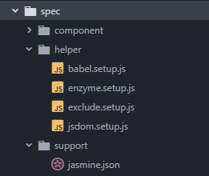

# Enzyme
# 使用Jasmine搭建enzyme的测试环境
## 准备
1. 搭建一个React的开发环境
2. 搭建基本的Jasmine测试环境

## 依赖模块
- enzyme
- jasmine-enzyme
- jsdom
- enzyme-adapter-react-16(针对react 16.x)

enzyme 为react测试提供核心的API  
enzyme-adapter-react-16 enzyme的react适配器，用于向Enzyme配置正确的react版本   
jasmine-enzyme 是jasmine配合enzyme使用的扩增matcher库，增加了许多UI测试的断言API，但不是必须的  
jsdom 由于nodeJS没有DOM环境，jsdom可以提供一个node的DOM环境，用于react构造组件和虚拟DOM  

- react
- react-dom
- babel-core 或 babel-register
- babel-preset-react
- jasmine

这部分依赖是在构建react和jasmine环境是要用到的，同时也是搭建Enzyme测试环境必须的依赖  

Jasmine似乎不支持ES6的一些语法(import)，所以在测试文件开头都要导入`babel-register`或`babel-core\register`进行语法的转码，而`babel-core\register`在Babel 7.x之后就从`babel-core`移除


## 配置
- babel setup
- enzyme setup
- jsdom setup
- style setup

这些配置都是在测试的前期准备，可以理解为`beforeEach`，通过创建相应的配置文件，配置到`jasmine.json`的`helpers`列表中即可  

同时这些配置文件的引入顺序也要按上述的顺序

### babel setup
引入babel对ES6的语法进行翻译

```javascript
// babel.setup.js
require("babel-register");
```
或
```javascript
// babel.setup.js
require("babel-core/register");
/*
"babel-core/register" is same as "babel-register"
Since Babel7.x, "register" was removed from "babel/core"
*/
```

### enzyme setup
配置Enzyme的React适配器  
在每个spec启动前加载jasmine-enzyme

```javascript
//enzyme.setup.js
import jasmineEnzyme from "jasmine-enzyme";
import { configure } from "enzyme";
import Adapter from "enzyme-adapter-react-16";

configure({ adapter: new Adapter() });

beforeEach(function() {
  jasmineEnzyme();
});
```

若不使用jasmine-enzyme，则只需要：
```javascript
//enzyme.setup.js
import { configure } from "enzyme";
import Adapter from "enzyme-adapter-react-16";

configure({ adapter: new Adapter() });
```
### jsdom setup
提供node的DOM环境，若没有DOM环境，enzyme的`mount`和`shallow`无法成功模拟react控件，测试启动会抛异常

```javascript
//jsdom.setup.js
import {JSDOM} from 'jsdom';

const dom = new JSDOM('<html><body></body></html>');
global.document = dom.window.document;
global.window = dom.window;
global.navigator = dom.window.navigator;
```

### style setup
对于Enzyme模拟的组件来说，真正去加载组件中的图片或CSS样式是比较消耗资源，也是没有必要的，因此有一些文件是必须被忽略掉的，否则

`ignore-styles`这么包可以忽略文件中导入的样式文件
> npm install --save-dev ignore-styles

在测试文件中直接导入该模块即可自动忽略CSS样式文件的加载
```javascript
import "ignore-styles";
```

### jasmine.json helpers
将所有setup文件依次添加到jasmine.json的helpers列表中

```json
{    
    "helpers": [
        "helper/babel.setup.js",
        "helper/enzyme.setup.js",
        "helper/jsdom.setup.js",
        "helper/*.js"
    ]
}
```



## 使用Enzyme
在引入被测试的组件之前，必须向引入"react"
```javascript
import React from "react";
import { mount, shallow } from "enzyme";

import TodoList from "../../src/component/todo-list";

describe("todo list", () => {
  let wrapper = {};
  beforeEach(() => {
    wrapper = shallow(<TodoList />);
  });

  it("title", () => {
    //toHaveClassName 和 toHaveClassName 都是jasmine-enzyme的断言API
    expect(wrapper.find("header")).toHaveClassName("title");
    expect(wrapper.find("header")).toHaveText("Todo List");
  });
});
```

## react的jasmine-enzyme开发技术栈
GitHub：https://github.com/Akigaze/react-jasmine-dev-stack

----------------------------
# 脚手架React项目使用enzyme测试
使用`create-react-app`搭建的项目需要将测试文件编写在src目录下，且以`.test.js`为后缀名  

`create-react-app`搭建的react项目默认使用Jest测试框架，要使用Enzyme是需要下载相关依赖：
> npm install --save enzyme enzyme-adapter-react-16 react-test-renderer

再在src目录下放置一个`setupTests.js`文件，类似jasmine的`enzyme.setup.js`:
```javascript
import { configure } from 'enzyme';
import Adapter from 'enzyme-adapter-react-16';

configure({ adapter: new Adapter() });
```

然后就可以使用enzyme的API进行测试了

----------------------------------
# Render mode
-  Shallow Rendering
-  Full Rendering
-  Static Rendering

## Shallow Rendering
> Shallow rendering is useful to constrain yourself to testing a component as a unit, and to ensure that your tests aren't indirectly asserting on behavior of child components.

### shallow(node[, options]) => ShallowWrapper
`shallow` API does call React lifecycle methods such as `componentDidMount` and `componentDidUpdate`.

`shallow`函数时Enzyme进行的浅渲染的函数，它不会对子组件进行渲染，因而可避免子组件对父组件的测试干扰

`ShallowWrapper`对象可以是单个值，也可以是数组的形式

Arguments：
1. node (ReactElement): The node to render
2. options (Object [optional]):
    - options.context: (Object [optional]): Context to be passed into the component
    - options.disableLifecycleMethods: (Boolean [optional]): If set to true, `componentDidMount` is not called on the component, and `componentDidUpdate` is not called after `setProps` and `setContext`. Default to false.

### ShallowWrapper API
#### .find(selector) => ShallowWrapper
Arguments：  
- selector (EnzymeSelector): The selector to match.

selector的类别:

1. CSS Selectors:

    ```javascript
    const wrapper = shallow(<MyComponent />);
    // class select
    wrapper.find('.foo')
    wrapper.find('.bar')

    // id selector
    wrapper.find('#foo')

    // compound selector
    wrapper.find('div.some-class')
    ```

2. Component Constructors:
```javascript
import Foo from '../components/Foo';
wrapper.find(Foo)
```

3. Component Display Name:
```javascript
const wrapper = shallow(<MyComponent />);
expect(wrapper.find('Foo').length).toBe(1);
```
4. Object Property Selector:
```javascript
const wrapper = shallow(<MyComponent />);
expect(wrapper.find({ prop: 'value' })).not.toExist();
```

#### .findWhere(fn) => ShallowWrapper

类似于Array.filterde API ?????  
在Enzyme中也有一个`filterWhere`的API，但这两个貌似功能是一样的 ???

```javascript
const wrapper = shallow(<DemoList />)
let items = wrapper.find(DemoItem);
let enzymes = items.findWhere(i => i.prop("text").includes("Enzyme"));
expect(enzymes.length).toEqual(2);
```

#### .filter(selector) => ShallowWrapper
与`find`相似，一般在find之后使用

#### .filterWhere(predicate) => ShallowWrapper
与`findWhere`相似，一般在find之后使用

### .not(selector) => ShallowWrapper
筛选恰好与`filter`，选出不符合的内容，一般在find之后使用

#### .hostNodes() => ShallowWrapper
> Removes nodes that are not host nodes; e.g., this will only return HTML nodes.

应该是返回原生HTML的标签的对象
```javascript
const wrapper = shallow((
    <div>
        <DemoItem className="foo" test="foo" />
        <p className="foo" id="haha"/>
        <div className="foo" id="hoho"/>
    </div>
));
expect(wrapper.find(".foo").hostNodes().length).toBe(2);
```

#### .contains(nodeOrNodes) => Boolean
Arguments
- nodeOrNodes (ReactElement|Array<ReactElement>): The node or array of nodes whose presence you are detecting in the current instance's render tree.

只有当wrapper对象包含参数中的所有Node元素，才返回true

```javascript
// one ReactElement
expect(wrapper.contains(<div data-foo="foo">Hello</div>)).toEqual(true);
// ReactElement array
expect(wrapper.contains([
  <span>Hello</span>,
  <div>Goodbye</div>,
])).toEqual(true);
```

#### .first() => ShallowWrapper
取匹配过后的节点集中的第一个

```javascript
expect(wrapper.find("DemoItem").first().length).toBe(1);
expect(wrapper.find(DemoItem).first().prop("text")).toBe("React");
```

#### .prop(key) => Any

根据指定的key，获取wrapper对象想要`props`中的属性值，只用于单一的node节点

> .prop(key) only returns values for props that exist in the root node.

`prop`函数只能获取组件render是使用的props属性，而没有被使用到的无法返回得到；且只有在调用的wrapper对象的根节点上的属性才能被读取到

#### .props() => Object

返回组件的props属性对象，但并不是完整的对象，只有在组件的render方法中使用的prop才会返回

若要返回完整的props，要使用`wrapper.instance().props`

#### .state([key]) => Any
根据key返回state中相应的属性值，若不指定key，则是返回整个state对象
```javascript
const wrapper = shallow(<MyComponent />);
expect(wrapper.state().foo).to.equal(10);
expect(wrapper.state('foo')).to.equal(10);
```

#### .text() => String
返回整个组件中所有的字符串

```javascript
let wrapper = shallow(<div><b>important</b></div>);
expect(wrapper.text()).to.equal('important');

wrapper = shallow(<div>it is <b>important</b>.</div>);
expect(wrapper.text()).to.equal('it is important.');
```

#### .map(fn) => Array<Any>
相当于`Array.map`

#### .forEach(fn) => Self
相当于`Array.forEach`

#### .at(index) => ShallowWrapper
获取一个 node 集合中指定索引的对象

#### .get(index) => ReactElement
功能与`at`相似，但返回的结果是一个`ReactElement`，无法再使用`find`等方法，但`at`方法依然适用
```javascript
const wrapper = shallow(
  <div>
    <ul>
      <li>1</li>
    </ul>
    <ul>
      <li>3</li>
    </ul>
  </div>
);
let ul_2 = wrapper.find("ul").get(1);
expect(ul_2.find).toBe(undefined);
let lis = wrapper.find("li");
expect(lis.at(2).text()).toBe("3");
```

#### .equals(node) => Boolean
判断当前wrapper是否为指定的node，参数必须是一个`ReactElement`对象，即JSX的HTML对象
```javascript
const wrapper = shallow(<MyComponent />);
expect(wrapper.equals(<div className="foo bar" />)).toEqual(true);
```

#### .setProps(nextProps[, callback]) => Self
> A method that sets the props of the root component, and re-renders. Useful for when you are wanting to test how the component behaves over time with changing props. Calling this, for instance, will call the `componentWillReceiveProps` lifecycle method.

> Similar to setState, this method accepts a props object and will merge it in with the already existing props.

修改props的值，并且会自动进行render，触发`componentWillReceiveProps`生命周期方法

只能用于直接`shallow`生成的对象

Arguments
- nextProps (Object): An object containing new props to merge in with the current props
- callback (Function [optional]): If provided, the callback function will be executed once `setProps` has completed

```javascript

```

#### .instance() => ReactComponent
> Gets the instance of the component being rendered as the root node passed into shallow()

生成react的组件对象示例，但只有直接通过`shallow()`获得的wrapper才有效

> can only be called on a wrapper instance that is also the root instance. With React 16.x, instance() returns null for stateless React component/stateless functional components.

在 React16.x之后，只有class级别的组件才能成功返回组件对象实例，而function级别的返回null

#### .is(selector) => Boolean
> Returns whether or not the current node matches a provided selector.

Arguments
- selector (EnzymeSelector): The selector to match.

Returns
- Boolean: whether or not the current node matches a provided selector.

```javascript
const wrapper = shallow(<div className="some-class other-class" />);
expect(wrapper.is('.some-class')).toBe(true);
```

#### .exists([selector]) => Boolean
> Returns whether or not the current node exists. Or, if a selector is passed in, whether that selector has any matching results.

Arguments
- selector (EnzymeSelector [optional]): The selector to check existence for.

Returns
- Boolean: whether or not the current node exists, or the selector had any results.

```javascript
const wrapper = mount(<div className="some-class" />);
expect(wrapper.exists('.some-class')).toBe(true);
expect(wrapper.find('.other-class').exists()).to.Be(false);
```

#### .hasClass(className) => Boolean
> Returns whether or not the current node has a className prop including the passed in class name.

Arguments
- className (String): A single class name.

Returns
- Boolean: whether or not the current node has the class or not.

```javascript
const wrapper = shallow(<MyComponent />);
expect(wrapper.find('.my-button').hasClass('disabled')).toBe(true);
```

#### .context([key]) => Any

# Link
### Github
FormidableLabs/enzyme-matchers/packages/jasmine-enzyme
https://github.com/FormidableLabs/enzyme-matchers/tree/master/packages/jasmine-enzyme  
jsdom/jsdom  
https://github.com/jsdom/jsdom
### Jasmine官网
Testing a React app with Jasmine npm  
https://jasmine.github.io/tutorials/react_with_npm
### Enzyme Document
https://airbnb.io/enzyme/
### Create React App Official
test  
https://facebook.github.io/create-react-app/docs/running-tests
