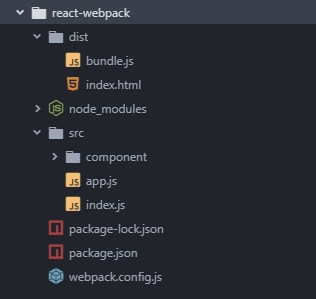
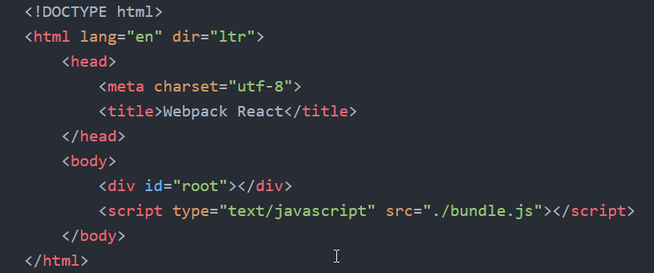
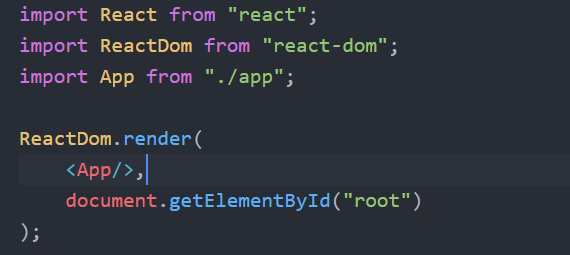
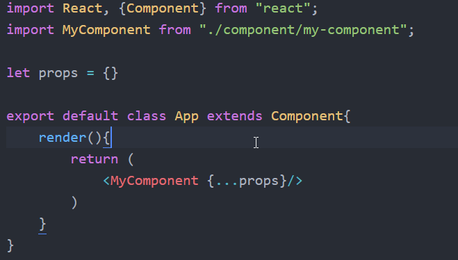

## react module

- react
- react-dom

## 对象和方法

### react

- ReactDOM
  1.  render(component, DOMOnject): 将`component`插入到`DOMOnject`中
- React
  1.  createElement(
      type,
      [props],
      [...children]
      )

## JSX 语法

- 所有 JSX 编写的 HTNL 都是虚拟 DOM 的对象，且每个虚拟 DOM 的对象向都必须有一个根标签
- 在 JSX 中的 JS 代码必须放置在`{}`中，`{}`中若还有 JSX 代码，则其中的 JS 代码还需要继续加`{}`

## 创建组件

1.  工厂函数
    - 返回值的 JSX 标签
    - 方法名大写开头
    - 以`<方法名></方法名>`的形式应用
    - 函数有一个`props`参数
2.  组件类
    - 继承`React.component`
    - 重写`render`方法，返回 JSX 标签
3.  ES5 创建组件
    - 使用`React.createClass`

## React.Component

### 组件的三大属性 `props`, `refs`, `state`

### props

- 只读属性

### refs

- 用于引用真实的 DOM 对象
- 在需要绑定真实 DOM 的组件标签上添加`ref`属性，并指定一个名称
- 使用`this.refs.refName`可以获取指定`refName`绑定的真实 DOM 对象

### state

- 组件的内部数据状态，`state`的修改会触发组件的重新渲染
- 一般在`constructor`中对`state`进行初始化`this.state={...}`
- 只能使用`this,setState`方法对组件的`state`进行修改，方法的参数是一个对象

### 默认 Props

```javascript
ClassName.defaultProps={
    ...
}
```

### Prop 检验

限定组件可传入的 prop 的数据类型以及必要性

```javascript
import PropTypes from "prop-types";

ClassName.propTypes = {
  optionalArray: PropTypes.array,
  optionalBool: PropTypes.bool,
  optionalNumber: PropTypes.number,
  optionalObject: PropTypes.object,
  optionalString: PropTypes.string,
  optionalMessage: PropTypes.instanceOf(Message),
  optionalEnum: PropTypes.oneOf(["News", "Photos"]),
  requiredFunc: PropTypes.func.isRequired,
  requiredAny: PropTypes.any.isRequired
};
```

### 事件机制

- 事件名称：驼峰命名法，`on`开头
- 事件参数：`event.target`表示触发事件的 DOM 对象

### 状态改变

react 控件的状态和各种值是单向改变的，即无法通过在界面修改 UI 来修改虚拟 DOM(除非`setState`)，如：

```javascript
class Controller extends React.Component{
  render(){
    let {msg} = this.state
    return (
      <div>
        <input type="text" value={msg}/>
        <input type="text" value="Hello"/>
      </div>
    )
  }
}
这里的两个输入框的值，是无法通过在页面进行输入来操作的，因此在输入框中输入但是页面是不会变化的，因为没有引起虚拟DOM的改变，因而页面不会自动渲染
```

# create by webpack

## 1.所需要的依赖

- webpack
- webpack-cli

> npm install --save-dev webpack webpack-cli

- babel-core
- babel-cli
- babel-loader
- babel-preset-env
- babel-preset-react

> npm install --save-dev babel-core babel-cli babel-loader@7 babel-preset-env babel-preset-react

由于默认安装的 babel-core 和 babel-cli 是`6.x`的版本，而 babel-loader 是`8.x`的版本，这个版本的 babel-loader 需要`7.x`以上的 babel-core，因此要降低 babel-loader 的版本到`7.x`，以适应 babel-core 和 babel-cli。

- react
- react-dom

> npm install --save react react-dom

## 2.项目结构

- node_modules
- dist
  - index.html
  - bundle.js
- src
  - component
  - app.js
  - index.js
- .babelrc
- webpack.config.js
- package.json



## 3.配置文件

### webpack.config.js

```javascript
const path = require("path");

const config = {
  entry: "./src/index.js",
  output: {
    path: path.resolve(__dirname, "dist"),
    filename: "bundle.js"
  },
  module: {
    rules: [
      {
        test: /\.js/,
        use: {
          loader: "babel-loader",
          options: {
            presets: ["env", "react"]
          }
        },
        exclude: /(node_modules|bower_components)/
      }
    ]
  },
  //开启监听
  watch: true,
  watchOptions: {
    ignored: /node_modules/,
    aggregateTimeout: 2000
  },
  mode: "development"
};

module.exports = config;
```

### .babelrc(可选)
若 webpack.config.js 配置 loader 的 `options` ，则可以不需要
```json
{
  "presets": ["env", "react"]
}

```
### package.json
webpack打包项目的命令
```json
...
"scripts": {
   "build": "webpack --webpack.config.js"
 }
 ...
```

## 4.文件基本结构
### index.html
1. 提供一个App的容器，如：`<div id="root"></div>`
2. 引用webpack打包后的bundle.js文件



### index.js
使用`ReactDOM`将APP组件渲染到index.html的容器中


### app.js
将其他子组件组装成一个app


---

## 准备工作

1.  安装 NodeJS
2.  安装 `webpack`

    > npm install -g webpack  
    > npm install -g webpack-cli

3.  初始化项目

    > npm init -y

4.  创建项目目录

- node_module
- src
  - mian.js
- dist
  - bundle.js
- index.html
- package.json
- webpack.config.js

5.  配置`webpack.config.js`

```javascript
const path = require("path");
module.exports = {
  entry: "./src/main.js",
  output: {
    path: path.resolve(__dirname, "dist"),
    filename: "bundle.js"
  },
  watch: true,
  mode: "development"
};
```
