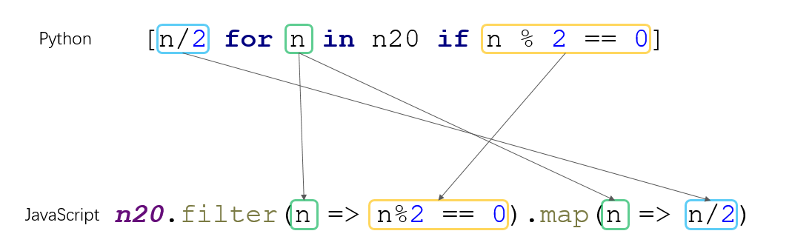

Python基础
===

### 输入与输出

1. 输出：`print(a, b, c, ...)`
2. 输入：`input('tip')` ，`'tip'` 是在输入用户之前打印的文本，为可选参数

### 注释

```python
# 这是python注释
```

### 数据类型

#### 1. 整数(int)，浮点数(float)

- python 没有 `++` 或者 `--` 的操作

#### 2. 字符串(str)

1. python的字符串类型表示为 `str`
2. 同时支持 **单引号** 和 **双引号** 编写字符串
3. 多行字符串可以使用 **三个单引号** `'''...'''`
4. `r''` 可以让 `''`  引号中的内容不用转义，对 **三个单引号** 也适用：`print(r'\\\t\\')` --> `\\\t\\`
5. 与JS一样，字符串不是引用类型
6. 采用 **Unicode** 编码
7. 不能使用 `+` 拼接字符串和数字(异常：`TypeError: must be str, not int`)

#### 字符串编码

- `ord(char)` 获取单个字符对应的十进制的Unicode码
- `chr(number)` 获取Unicode对应的字符
- `'\u4e2d\u6587'` 直接使用Unicode的字符串，返回对应的字符 `中文`
- `b'...'` 将字符串中的每个字符都以单个字节的形式存储，所以中文等需要用到多个字节存储的字符不适用
- `str.encode('编码类型')` 用指定字符集编码字符串，字符集有 `utf-8`, `ascii` 等
- `b'..'.decode('编码类型')` 将字节码按指定字符集解码成字符串
- 在 `.py` 文件开头添加 `# -*- coding: utf-8 -*-` 指定文件的编码类型

#### 字符串方法

1. `len(str)` 返回字符的个数，如果参数是字节类型(`b'as'` 等) ，则返回字节数
2. `%` 格式化字符串：`'Hi, %s, you have $%d.' % ('Michael', 1000000)` ，格式化字符串中的 `%` 字符使用 `%%` 进行输出
3. `str.format()` 格式化字符串，在字符串中使用 `{数字}` 的形式作为占位符，`{数字：x}` x 为一些格式约束


#### 3. 布尔值(bool)

1. `True` 和 `False`
2. 运算符：`and` `or` `not`

#### 4. 空值

1. `None`

#### 5. 类型转化

- str --> int：`int(str)` 将字符串转化成正数，参数必须是一个整数的字符串 (异常：`ValueError`)
- float --> int: `int(float)`
- str --> float: `float(str)`
- any --> str: `str(any)`
- any --> bool: `bool(any)`

#### 6. 类型检查

`isinstance(data, (type1, type2,..))`

### 运算符

#### 1. 除法

1. `/` 普通除法
2. `//` 地板除法，即只取整数部分

# 数据结构

## 1. list(列表)
```
a = ['a', 'b', ...]
```
* 元素可变，元素类型随意
* 支持排序
* 使用索引查找元素(`list[0]`) , 正数表示正序查找，负数为倒叙查找
* 使用 `len()` 函数获取列表长度：`len(list)`
* 按值查找麻烦
#### 生成list

1. `list(序列)` : 将 `range` 函数等生成的序列转换成一个list
2. `range(start, end)` : 生成一个整数序列，包头不包尾，但注意返回的不是一个list，只是一个序列

#### list 相关方法

- `.append(element)` : 追加元素
- `.insert(index, elemrnt)` : 在指定索引的位置插入元素
- `.pop()` : 删除末尾的元素
- `.pop(index)` : 删除指定索引的元素
- `.sort()` : 排序，默认正序

## 2. tuple(序列，元组)
```
B = ('a', 'b', ..)
```
* 相当于不可变list
* 长度不可变，索引的对象地址不变
* 本身不排序
* 适合存放不可变的内容
* 定义指定长度的tuple，需要在长度后面加上逗号：`tuple1 = (4,)`
## 3. dict(字典)

```
C = {key:value,...}
```
- 键值对的形式存储数据，类似于json对象
- `key` 必须是不可变的值

#### 取值

1. `[key]` : 使用索引的形式获取值，当指定的 `key` 不存在时，抛异常：`KeyError`
2. `.get(key)` ：获取指定 `key`对应的值，当 `key` 不存在时，返回 `None`
3. `key in dist` : 判断指定 `key`  在字典中是否存在

#### dict的方法

- `.pop(key)` : 删除指定 `key` 的键值对
- dict 的key应写成字符串形式，若直接写变量名，python会将变量的值作为key

```python
# dist 字典,类似于json对象
persons = {"Newton": 10, "Galileo": 45, "Einstein": 57, "Edison": 67}

# in 判断是否存在指定key
print("Newton" in persons)
print("Marx" in persons)

# [] 取值
print(persons["Einstein"])
print(persons["Marx"]) # KeyError

# .get 取值
print(persons.get("Edison"))
print(persons.get("Marx"))  # None

# .pop 删除
persons.pop("Galileo")
```

### 4. set 集合

```python
set1 = {"a", "b", ...}
```

- 相当于一个 **无序** **不重复** 的list
- 实现原理与 dict 相同，只有 `key` 没有 `value`
- 自动去重

#### 创建set

1. `set(list)` ：`set`  函数将一个 list 转换成 set
2. `{key1, key2,...}` ：类型定义dict的形式，不指定 value

#### set的方法

- `.add(key)` : 添加元素
- `.remove(key)` ：删除指定元素，当指定的 `key` 不存在时，抛出异常：`KeyError`
-  `&` : 对两个set取交集
- `|` : 对两个set 取并集

```python
set1 = set(["Einstein", "Newton", "Galileo", "Newton", "Einstein", "Edison"])
set2 = {"Einstein", "Newton", "Galileo", "Newton", "Einstein", "Edison"}

set1.add("Marx")
print(set1)

set2.remove("Galileo")
# set2.remove("Washington")  # KeyError
print(set2)

num1 = {1, 3, 5, 7}
num2 = {1, 5, 2, 6}
print(num1 & num2)
print(num1 | num2)
```

### 5. 空代码块 pass

因为python中没有 `{}` 表示代码块，所以要设置 **空循环体**，**方法体**，**if操作** 等，可以用 `pass` 关键字代替

# 流程控制语句
### 1. if...else

- 在 `if` 的条件之后或者 `else` 之后，要带上冒号 `:`
- `else if` 在python中写成 `elif`
- 与JavaScript相似， `if` 的判断条件不一定要是 `True` 或 `False` ，**非零数值**、**非空字符串**、**非空list** 等，就判断为 `True`，否则为 `False`。

```python
age = 20
if age <= 18:
    print("未成年人。")
elif age<=40:
    print("中年人。")
else:
    print("老年人。")
```

### 2. for 循环

- `for i in list:` 的形式，对list或序列(`range`)进行遍历
- 循环声明要以 `:` 结尾，再编写循环体

```python
names = ["Einstein", "Newton", "Galileo", "Edison"]
for name in names:
    print("name: %s\t length: %d" % (name, len(name)))

sum1 = 0
for i in range(0, 5):
    sum1 += i
print("sum1 = %d" % sum1)
```

### 3. while 循环

- `while condition:` 的形式，与其他语言 `while` 循环的用法相同
- 循环条件之后要加 `:` ，在编写循环体

```python
sum1 = 0
cur = 1
while cur < 10:
    sum1 += cur
    cur += 1
print("result %d" % sum1)
```

### 4. break & continue

- `break`: 结束循环
- `continue`: 跳过当前循环

# 函数

### 1. 调用

- 当传参多余定义的参数数量时，会抛出异常：`TypeError`
- 当参数的类型不对时，会抛出异常：`TypeError`
- 与JavaScript相似，函数名只是一个变量的引用而已，可以任意赋值或者赋值给其他变量
- python函数传参可以使用 `参数名 = 值`  的形式，为指定名称的参数赋值，这与R语言类似，但其实JavaScript也支持这样的传参方式

### 2. 定义

- `def funcName(args):` 形式声明一个函数
- `return` 关键字返回值，`pass` 关键字声明空的方法体

```python
#定义函数
def test1():
    print("函数test")
#调用函数
test1()

def test2(a,b):
    print("函数test2",a,b)
test2("hello","world")

def test3(a,b,c):
    d=a+b+c
    print("函数test3",d)
    return d #有返回值
print(test2(1,2,3))
```

#### 返回值

- python的方法支持多返回值，返回值之间用逗号分隔： `return a, b, c`
- 多返回值的实质是返回一个 **tuple**， 只是返回 tuple 时可以省略括号而已
- 调用多返回值的函数是，可以使用一个变量接收所有返回值，此时该变量就是一个 tuple；也可以用多个变量接收返回值，多个变量用逗号分隔，分别接收每一个返回值，此时接收返回值的变量个数必须与返回值个数相同，否则抛出异常：`ValueError: too many values to unpack` 或 `ValueError: not enough values to unpack`

```python
def get_date():
    return 2019, 4, 21

one_date = get_date()
y, m, d = get_date()
print(one_date, y, m, d)

# y, m = get_date()  ValueError: too many values to unpack
# y, m, d, x = get_date()  ValueError: not enough values to unpack
```

#### 默认参数

- 在定义参数时使用 `=` 在参数列表中为参数赋上默认值
- 默认参数要置于非默认参数之后
- python中方法参数列表中的参数也是变量，当多次调用函数使用默认参数时，默认参数引用的是同一个对象
- 默认参数应该的值应该是 **不变对象**

```python
def add_end(name="Marx", li=[]):
    li.append("end")
    return name, li

print(add_end())  # ('Marx', ['end'])
print(add_end())  # ('Marx', ['end', 'end'])
print(add_end())  # ('Marx', ['end', 'end', 'end'])
```

#### 可变参数

- 在参数名前面加上 `*` ，表示后面的变量是一个可变参数，可以接受任意数量的参数
- 可变参数要放在必选参数之后
- 可变参数的参数变量在方法体中是一个 tuple
- 在调用函数时，运行在list 或者 tuple等类型的参数前加 `*` 将其转化成多个参数，相当于 JavaScript的解构
- `*` 的一个作用是将 `1,2,3` 形式的序列转化成tuple `(1,2,3)` ；另一个作用是将 tuple 或list `(1,2,3)` 分解成 序列 `1,2,3`

```python
def get_sum(*params):  # * 参数组装
    sum1 = 0
    for p in params:
        sum1 += p
    return sum1


print(get_sum(1, 2, 4, 5))
list1 = [1, 2, 3, 4]
tuple1 = (0, 2, 4, 6, *lsit1)  # * 参数分解
# * 参数分解
print(get_sum(*list1))
print(get_sum(*tuple1))
```

#### 关键字参数

- 关键字参数使用 `**` 标示，同样在函数定义或者调用时可以使用
- 与可变参数相似，但是关键字参数组装或分解的是 **dict** 结构
- 关键字参数在调用传参时，参数要写成 `key = value` 的形式(**key不能写成字符串形式**)，方法中会将参数转化成指定key和value的一个dict
- 在组装dict对象是，也可以使用 `**` 将另一个dict 的内容复制给目标dict：`{"name":“Marx", **dict2}`
- `def func(name, *, age, gener)` 中的 `*,` 表示后面的参数都是关键字参数(**命名关键字参数**)，即限定了只能传某些特定关键字的参数，并且这些关键字参数也可以设置默认值

```python
# 关键字参数
def enroll(name, gender, **other):
    return {"name": name, "gender": gender, **other}

def hello(name, *, gender, age=6):
    return {"name": name, "gender": gender, "age": age}

print(enroll("Marx", "F"))
print(enroll("Marx", "F", age=10))
ming = {"gender": "F", "name": "Ming", "age":10, "score": 100}
print(enroll(**ming))
print(hello("Ming", gender="F"))
# print(hello("Ming", "F"))  # TypeError: hello() takes 1 positional argument but 2 were given
# print(hello("Ming", gender="F", city="NY"))  #TypeError: hello() got an unexpected keyword argument 'city'
```

#### 组合参数

python中的多种类型的参数，可以在一个方法定义中组合使用，声明的顺序是：

> 必选参数、默认参数、可变参数、命名关键字参数和关键字参数

```python
def f1(a, b, c=0, *args, **kw):
    pass

def f2(a, b, c=0, *, d, **kw):
	pass
```

## list,dict特性
### 切面(slice)
一种数组的截取快捷方法，使用 `list1[m:n:x]` 的形式
- 包头不包尾
- n > m, m 和 n 为元素索引，0 表示第一个元素，-1表示最后一个元素
- m 省略默认是 **0**，n 省略表示 **-1+1**，指 **包括最后一个元素**
- x 为步长，每次取值间隔的个数，从m的位置开始计算，最后一个 `:x` 省略默认是1
- `list1[:]` 表示将原数组拷贝一份(不同实例)

```python
n100 = list(range(0, 100))
print(n100)
print(n100[0:10])
print(n100[:5])
print(n100[10:15])
print(n100[-5:-1])
print(n100[-1:-5]) # []
print(n100[-4:0]) # []
print(n100[-10:])
print(n100[0:20:2])
print(n100[::2])
print(n100[-30::3])
print(n100[:] is n100)
```

对 tuple 和 str 也适用这种操作，并且输入的数据源是什么类型的数据结构，输出的结果是相同类型的数据

### 遍历(iterator)
python 中对数组，列表或字符串的遍历是使用 `for  in` ，而没有使用索引遍历的形式，而这种遍历方式同样可以用于dict

- 遍历key：`for key in dictX`
- 遍历value：`for value in dictX.values()`
- 遍历键值对：`for key, value in dictX.items()`

```python
nameDict = {
    "ming": "XIAO",
    "hong": "DA",
    "gang": "LI",
    "liang": "PIAO"
}

print("------- 按key进行遍历 --------")
for name in nameDict:
    print(name)

print("------- 按value进行遍历 --------")
for value in nameDict.values():
    print(value)

print("------- 按key, value进行遍历 --------")
for key, value in nameDict.items():
    print("%s : %s" % (key, value))
```

### 列表生成式(List Comprehensions)
python中对数组的map和filter操作的一种实现，使用 `[exp for x in list1 if condition]` 的像是
- `exp` 相当于map中的转化规则
- `condition` 就是filter中的过滤条件
- 先执行 **filter**， 再进行 **map**
- 多个`for`嵌套可以用 `[exp for x in list1 for y in list2 if condition]` 的形式，**y** 是内层循环的元素


```python
n20 = list(range(0, 20))
print("----- 类似于map操作 -----")
halfN20 = [n/2 for n in n20]
print(halfN20)

print("----- 类似于filter操作 -----")
evenOfN20 = [n for n in n20 if n % 2 == 0]
print(evenOfN20)

print("----- 类似于filter + map操作 -----")
evenOfN20PlusOne = [n+1 for n in n20 if n % 2 == 0]
print(evenOfN20PlusOne)

print("----- 嵌套 -----")
print([x + y for x in 'ABC' for y in 'XYZ'])
print([x + y for x in 'ABC' for y in 'XYZ' if x != 'B'])
```

导入函数
```python
import 文件名 as 自定义别名
```

## 数据分析依赖：数据质量，静态特征，行为特征
## 数据分析：
1. 了解业务
2. 方法论
3. 分析方法
4. 工具：软件，语言
5. 统计思维
